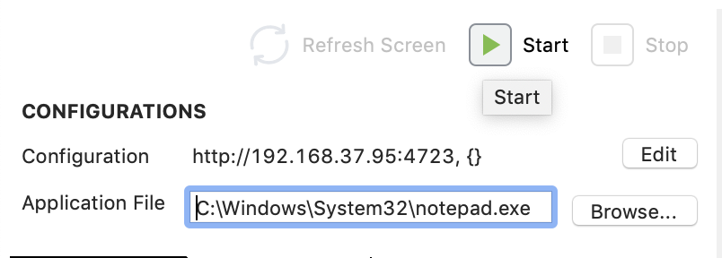
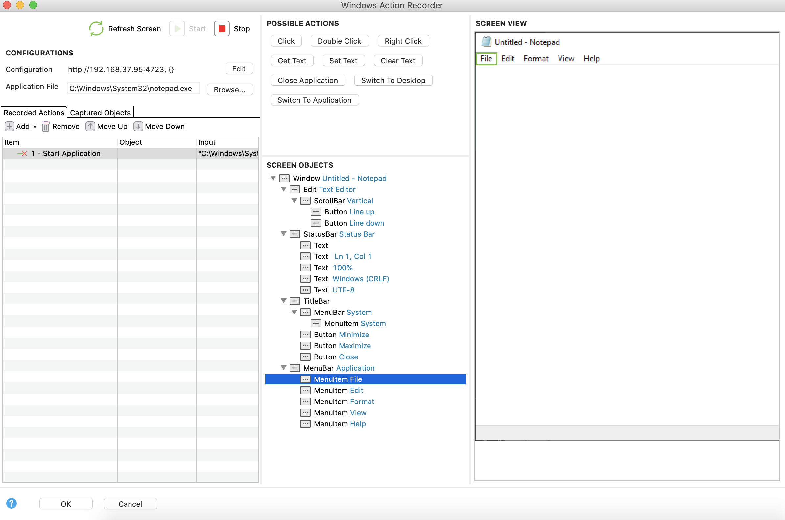
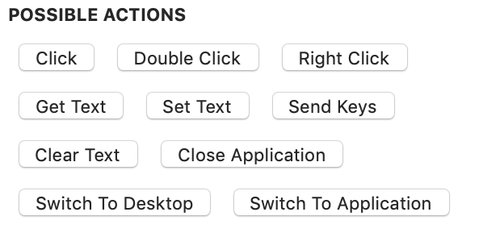
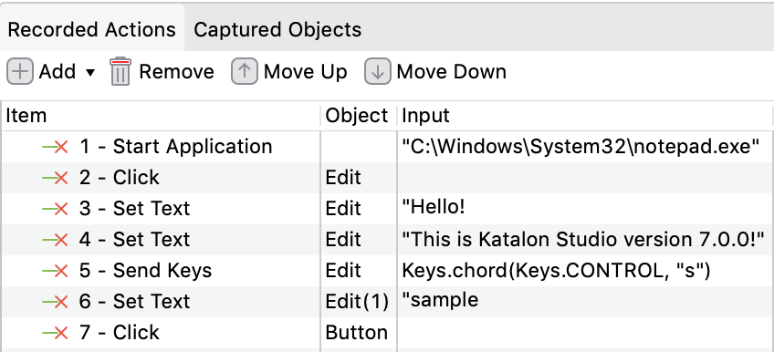
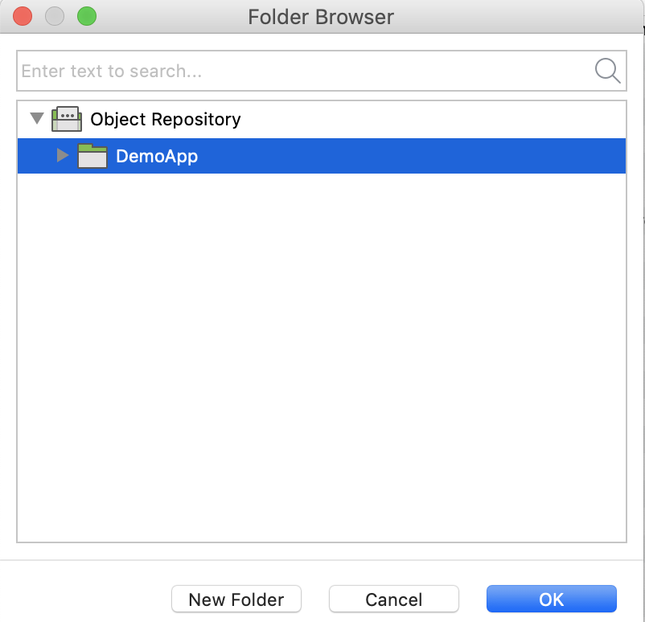
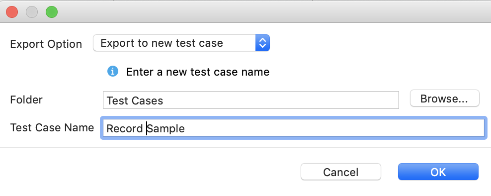
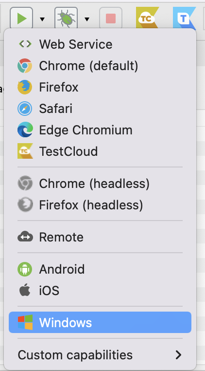

# Windows 录制教程

> - 从**7.0 版**开始，您可以在 Windows 桌面应用程序上录制测试。
> - 从**7.8 版**开始，Katalon 支持通过其相对坐标记录和定位 Windows 元素。

**前提**

- [设置 WinAppDriver](https://docs.katalon.com/katalon-studio/docs/setup-winappdriver.html)

## 基于坐标的记录

在 记录器 中，**可能的行动（Possible Actions）**中增加了**单击元素偏移（Click Element Offset）**和**右键单击元素偏移（Right-click Element Offset）**两个按钮，支持以下关键字：

- [[Windows\] 单击元素偏移](https://docs.katalon.com/katalon-studio/docs/windows-kw-click-element-offset.html)
- [[Windows\] 右键单击元素偏移](https://docs.katalon.com/katalon-studio/docs/windows-kw-rightclick-element-offset.html)

使用基于坐标的记录，Katalon Studio 除了记录元素的选择器之外，还记录元素的相对坐标。例如，您想单击红色 X 部分以关闭记事本中的选项卡。Katalon Recorder 将按钮的偏移量（其相对于其左上角的坐标）记录为一组表示 X 和 Y 偏移量的参数，并将它们保存在 clickElementOffset 中。它使用它们来识别在运行时执行单击操作的确切位置。

如果没有该元素的偏移量，测试引擎只能单击按钮的中心，从而导致测试失败。

## 记录

1. 要开始录制 Windows 操作，请单击Katalon Studio 主工具栏上的**录制 Windows 操作图标。**

2. 将显示 Windows 记录器对话框。在**配置（CONFIGURATIONS）**部分指定信息。

- **配置**：您可以在其中查看和编辑`WinAppDriver URL`和`所需的功能(Desired Capabilities)`。

- **应用程序文件**：测试机`Windows Executable File (*.exe)`文件的绝对路径。对于 Windows 用户，单击**”浏览...“**按钮以找到应用程序文件。
  
  填写应用程序文件文本框后，**开始**按钮会变为可点击状态。

  完成设置后单击**开始**。

3. 在测试机器上部署并打开了指定的 Windows 应用程序。

4. **屏幕视图**对话框将显示测试机上应用程序的当前屏幕截图。

   该屏幕截图中的所有 Windows 对象都在**屏幕对象**部分的树中进行分析和组织。

   单击该树中的任何对象，它都会相应地在屏幕视图中突出显示。

5. **选择一个元素，然后在可能的操作**部分指定要执行的操作。

6. 上面所有指定的操作都记录在**记录的操作**部分。

   在**Captured Objects**中，您可以查看在录制会话期间捕获的所有元素。在这里，您可以自定义捕获对象的定位器，方法是在**对象属性**的定位器选项卡中对其进行修改，然后单击**突出显示**以验证新定位器是否正确识别预期对象。

7. 如果需要，您可以停止应用程序或启动另一个应用程序。要重新加载**屏幕视图**和**屏幕对象**，只需单击**刷新屏幕**按钮。
   完成录制后，单击“**确定**”将录制的动作保存在 Katalon Studio 中。

8. 系统将提示您将捕获的对象保存在 Katalon Studio 的对象存储库中。选择现有文件夹或创建一个新文件夹，然后单击“**确定**”继续。

9. 完成录制会话后，将录制的步骤导出到新的测试用例。

10. 记录的对象和动作保存在测试用例中。

## 执行测试用例

请记住在执行测试用例之前打开 WinAppDriver。

选择主工具栏上**运行**按钮中的**Windows**图标来执行脚本。

相应地使用这些记录的步骤执行 Windows 测试。

> **备注**：
>
> 1. 请记住，在桌面应用程序上监视、记录或执行测试时不要锁定屏幕。
> 2. 建议您不要同时运行多个应用程序。
> 3. 要启动 UWP 应用程序，应用程序的执行文件应为：
>
> - *ApplicationID*（如果您的应用已在 Microsoft 商店中发布）
> - *PackageFamilyName!Application ID*（如果您的应用仍在开发中）

