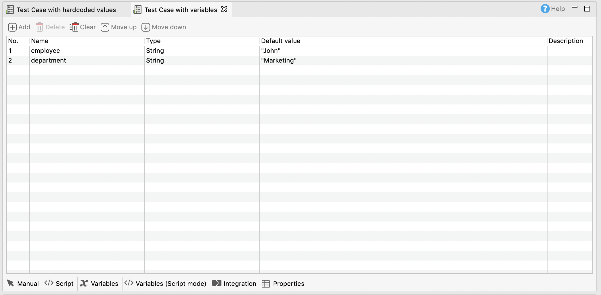
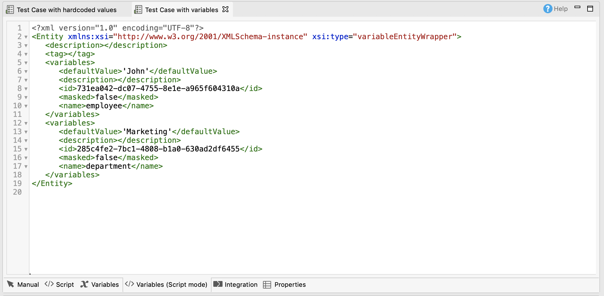
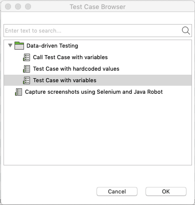
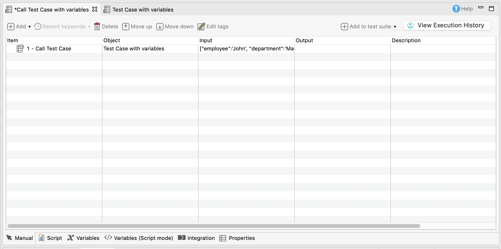
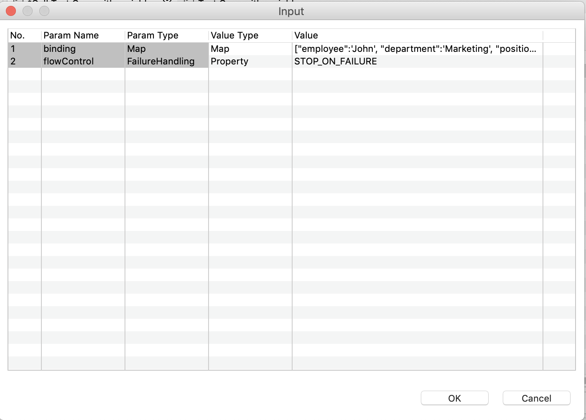
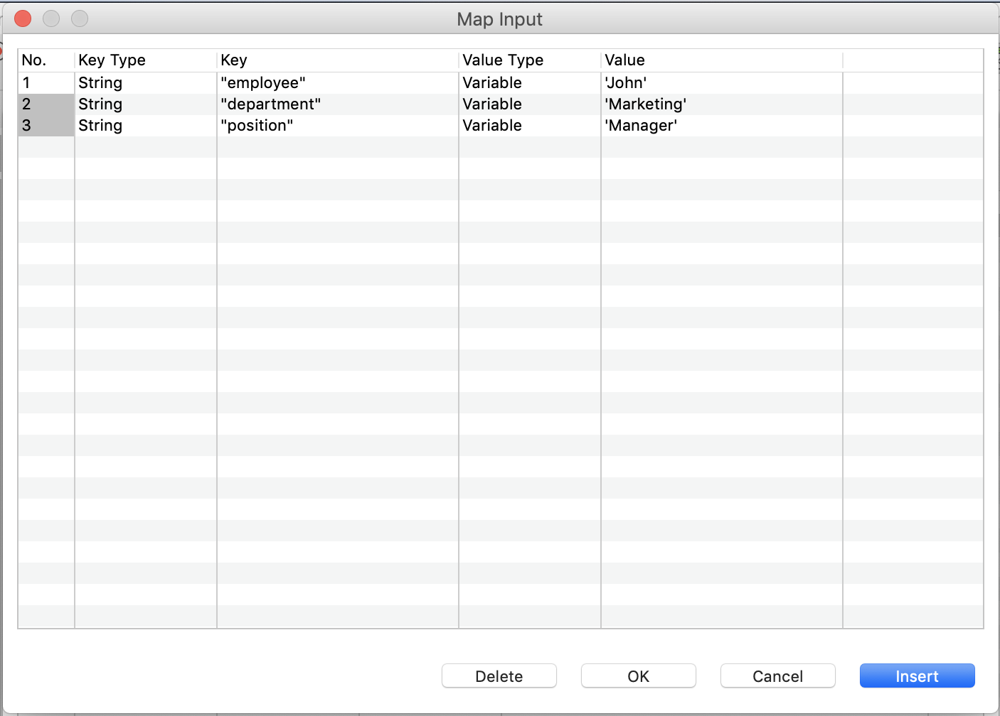

# 测试用例变量

您可以在 Katalon Studio 中运行测试用例变量来参数化您的测试用例或使用不同的输入调用该测试用例，而不是使用硬编码值运行测试用例。

在开始之前，让我们看一下带有硬编码值的测试用例示例：

```
String employee = 'John'
String department = 'Marketing'

println "${employee} - ${department}"
```

## 管理测试用例变量

以下语句将用作示例：

```
println "${employee} - ${department}"
```

在**测试用例编辑器的****变量**选项卡中：

1. 要使用网格视图添加变量，请切换到测试用例的**变量选项卡。**
2. 然后单击**添加**。一个新行被添加到变量列表中。
3. 输入变量。

*注意：记住完成后保存测试用例。*



使用变量运行测试用例后的结果将与硬编码值相同：


## 在脚本模式下查看和声明变量

切换到**变量（脚本模式）**选项卡，Katalon Studio 将显示一个 XML 格式的脚本编辑器。例如：



## 使用变量调用测试用例

1. **在手动**视图中打开一个测试用例，然后单击**添加**并选择选项**调用测试用例**。
2. 将显示显示项目中所有现有测试用例的**测试用例浏览器对话框。**选择要调用的测试用例并单击**OK**。

在以下示例中，将调用“带变量的测试用例”。


3. 将添加一个**调用测试用例**步骤，上面选择的测试用例作为其目标。







运行测试用例后的结果如下图所示：


### 以脚本模式调用测试用例

在**Script**选项卡中，callTestCase 方法允许用户调用另一个测试用例。请参考以下示例：

```
WebUI.callTestCase(findTestCase('Data-driven Testing/Test Case with variables'), [('employee') : 'John', ('department') : 'Marketing', ('position') : 'Manager'], FailureHandling.STOP_ON_FAILURE)
```

