# [Installation]

# 安装概述

Katalon Studio 可以在 macOS、Windows 和 Linux 上运行。

在安装之前，您需要验证您的计算机是否满足使用 Katalon Studio 的系统要求。您可以参考此文档了解更多详细信息：[支持的环境](https://docs.katalon.com/katalon-studio/docs/supported-environments.html)。

要安装 Katalon Studio，您可以参考以下文档。文档中的说明基于使用所有默认设置的标准安装。

- [在 macOS/Windows 上安装 Katalon Studio](https://docs.katalon.com/katalon-studio/docs/ks-installation-macOS-windows.html)
- [在 Linux (GUI) 上安装 Katalon Studio](https://docs.katalon.com/katalon-studio/docs/katalon-studio-gui-beta-for-linux.html)

通过我们的 Katalon Academy 课程了解更多信息：[测试自动化基础](https://academy.katalon.com/courses/test-automation-foundations/?utm_source=kat_docs&utm_medium=install_overview)。

# 支持的环境

> - Katalon Studio (KS) 提供适合个人测试需求的免费基本工具。对于高级业务解决方案，您可以购买 Katalon Studio Enterprise (KSE) 许可证。要比较 KS 和 KSE 之间的功能，您可以参考此文档：[Katalon Studio vs Katalon Studio Enterprise Features](https://docs.katalon.com/katalon-studio/docs/katalon-studio-vs-katalon-studio-enterprise.html)。
> - Katalon Runtime Engine (KRE) 是 Katalon Studio 的测试执行插件。KRE 允许您在命令行界面 (CLI) 中执行测试。

> 注意：
> - 建议使用最新版本的 Katalon Studio。 从 Katalon 网站下载最新版本[katalon 产品](https://www.katalon.com/download/)。
> - 从 Katalon Studio 7.9.0 版开始，不再不支持 32 位处理器。

## 系统要求

|                  |                                                              | Katalon Studio/Katalon Studio Enterprise                     | Katalon 运行时引擎 (KRE)                                     |
| :--------------- | :----------------------------------------------------------- | :----------------------------------------------------------- | :----------------------------------------------------------- |
| 操作系统         | 视窗                                                         | Windows 7、Windows 8 和 Windows 10 Windows Server 2012       |                                                              |
| 操作系统         | 苹果系统                                                     | macOS 10.11 或更高版本                                       |                                                              |
| 操作系统         | Linux                                                        | - 确保安装 OpenJDK 8.0。有关更多详细信息，您可以参考此文档：[安装 Katalon Studio for Linux](https://docs.katalon.com/katalon-studio/docs/katalon-studio-gui-beta-for-linux.html#install-katalon-studio-for-linux)。 - 支持 Gnome、KDE 或 Unity DE 的最新版本的 Linux 发行版。 - 在 Ubuntu 上测试。 | - 确保安装 OpenJDK 8.0。 有关更多详细信息，您可以参考此文档：[Install Katalon Runtime Engine for Linux](https://docs.katalon.com/katalon-studio/docs/katalon-studio-gui-beta-for-linux.html#install-katalon-studio-for-linux)。 - 基于 Debian、Ubuntu、RHEL、Fedora 和 CentOS 的发行版。 - 在 Ubuntu 上测试。 |
| 图形用户界面组件 | 所有操作系统都需要。                                         | KRE 没有 GUI 组件。有关使用 KRE 执行的更多信息，您可以参考此文档：[在 KRE 上的执行](https://docs.katalon.com/katalon-studio/docs/console-mode-execution.html#command-builder)。 |                                                              |
| 中央处理器       | 最低要求：2 GHz 或更快的 32 位 (x86) 处理器，或 64 位 (x64) 处理器 |                                                              |                                                              |
| 存储器           | 最低要求：2 GB RAM（32 位）或 4 GB RAM（64 位） 。推荐：4 GB RAM（32 位）或 8 GB RAM（64 位）。 | 最低要求：2 GB RAM（32 位）或 4 GB RAM（64 位）。 并发执行（以及使用 Docker 执行）的建议：并发会话数 x 2GB。 例如： 3 个并发执行会话的推荐 RAM 为 6GB (3 x 2GB)。 |                                                              |
| 硬盘             | 至少 1 GB 可用硬盘空间。根据项目源代码和生成的执行报告，需要额外的磁盘空间。 |                                                              |                                                              |

## 浏览器

| 桌面浏览器             | Windows 版本 | macOS 上的版本 | Linux 上的版本 | 笔记                                                         |
| :--------------------- | :----------- | :------------- | :------------- | :----------------------------------------------------------- |
| 互联网浏览器 (IE)      | 9、10、11    | 不适用         | 不适用         | 所需的 IE 配置：[Internet Explorer 配置](https://docs.katalon.com/katalon-studio/docs/internet-explorer-configurations.html)。 |
| 微软Edge               | 18           | 不适用         | 不适用         |                                                              |
| 微软Edge（谷歌浏览器） | 80+          | 80+            | 不适用         | Katalon Studio v7.3.0+ 支持                                  |
| 火狐                   | 56+          | 56+            | 56+            | 要将 Firefox 57 与 Katalon Studio 一起使用，请安装 Katalon Studio v5.1.0+ |
| 谷歌浏览器             | 58+          | 58+            | 58+            |                                                              |
| Opera                  | 不适用       | 不适用         | 不适用         |                                                              |
| 苹果浏览器             | 不适用       | 12+            | 不适用         |                                                              |

## 移动的

| 安装 | Windows 版本       | macOS 上的版本     | Appium  | 原生应用支持？ | 混合应用程序支持？(*) | 移动浏览器支持 | Xcode   |
| :--- | :----------------- | :----------------- | :------ | :------------- | :-------------------- | :------------- | :------ |
| 安卓 | 6.x、7.x、8.x、9.x | 6.x、7.x、8.x、9.x | 1.12.1+ | 是的           | 不（**）              | 是的           | 不适用  |
| iOS  | 不适用             | 9、10、11、12、13  | 1.12.1+ | 是的           | 不                    | 是的           | v9.4.1+ |

(*) 要处理混合应用程序，您可以在此处参考 Appium 文档：[自动化混合应用程序](http://appium.io/docs/en/writing-running-appium/web/hybrid/#automating-hybrid-apps)。

(**) 我们在这里提供了一些解决方法：

- [捕获混合 Android 应用程序中的元素](https://docs.katalon.com/katalon-studio/docs/capture-elements-in-hybrid-android-apps.html)。
- [使用自定义 SetText 关键字进行基于 Flutter 的应用程序测试](https://docs.katalon.com/katalon-studio/docs/flutter-based-application-testing.html)。

## Windows系统

Katalon Studio 完全支持在以下平台上编写的桌面应用程序的自动化测试：

- 通用 Windows 平台 (UWP)
- Windows 窗体 (WinForms)
- Windows 演示基础 (WPF)
- 经典 Windows (Win32)

# 在 macOS/Windows 上安装 Katalon Studio

本文提供有关如何在 macOS/Windows 上安装 Katalon Studio 的信息。

> 所需如下：
>
> - 用于注册 Katalon 帐户的有效电子邮件
> - 用于下载 Katalon Studio 的有效网络环境

## 支持的环境

> 从 Katalon Studio 版本 7.9.1 开始，我们仅支持 64 位 Windows、macOS 和 Linux。

在使用 Katalon Studio 之前快速检查一下系统要求。您可以在此处参考此文档：[支持的环境](https://docs.katalon.com/katalon-studio/docs/supported-environments.html)。

## 下载 Katalon Studio

1. 访问 Katalon 网站：[Katalon 产品](https://www.katalon.com/download/)。

2. 使用有效的电子邮件注册 Katalon 帐户，或者如果您已经有 Katalon 帐户，请登录到您的 Katalon 帐户。

3. 要下载 Katalon Studio，请单击在**Katalon Studio**框中**创建您的第一个测试**。Katalon 将引导您进入下载页面，它会自动检测并下载适合您系统的版本。

   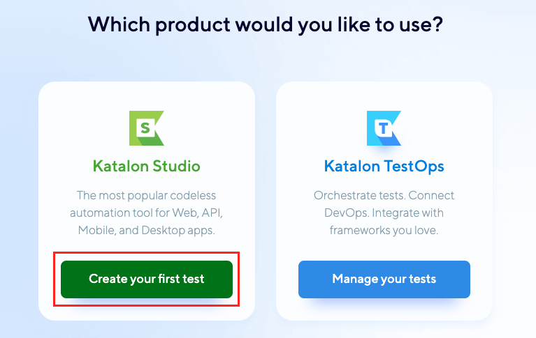

您还可以在页面上为您的系统选择首选版本。

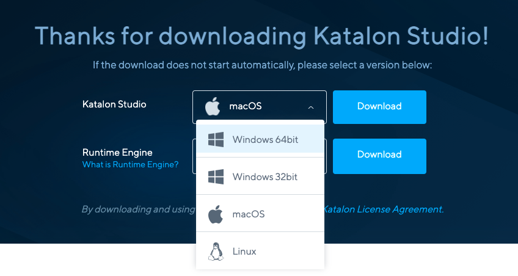

## 启动 Katalon Studio

▼对于 Windows 用户

1.下载 .zip 文件后，将其解压缩到`C:\Users\<username>`文件夹中。

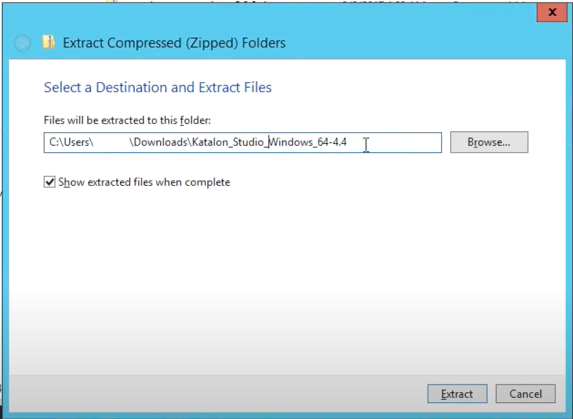

> **笔记**
> 对于 Windows 用户，如果您将 Katalon Studio 解压到`C:\Users\<username>`文件夹之外，请确保当前用户具有 Katalon Studio 软件包的读/写权限或以管理员权限，以运行该软件。

2. 要启动 Katalon Studio，请双击**katalon.exe**文件。

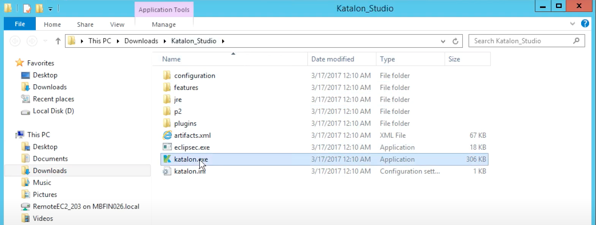

- 确保在 Katalon Studio 和当前操作系统中使用默认字体大小（设置为 100%），以避免名称字段不显示在某些弹出窗口上。

  要调整字体大小：

  - 对于 Windows，您可以在此处参考 Microsoft 文档：[编辑字体大小](https://support.microsoft.com/en-us/windows/change-the-size-of-text-in-windows-10-1d5830c3-eee3-8eaa-836b-abcc37d99b9a)。
  - 对于 Katalon Studio：转到**Window** > **Preferences** > **General** > **Appearance** > **Colors and Fonts**。选择**对话框字体**并编辑字体大小。

▼对于 macOS 用户

1. 下载 .dmg 文件后，双击它继续安装。

2. 出现提示时将 Katalon Studio 添加到**Application**文件夹。

   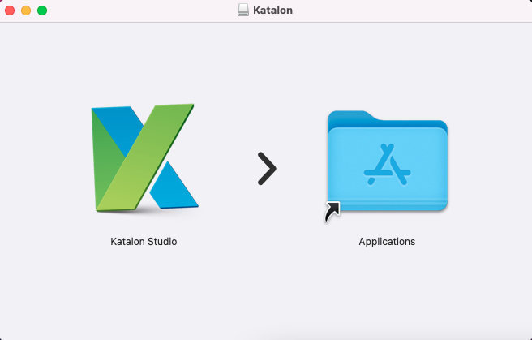

   3. 要启动 Katalon Studio，请双击**Katalon Studio**应用程序。

      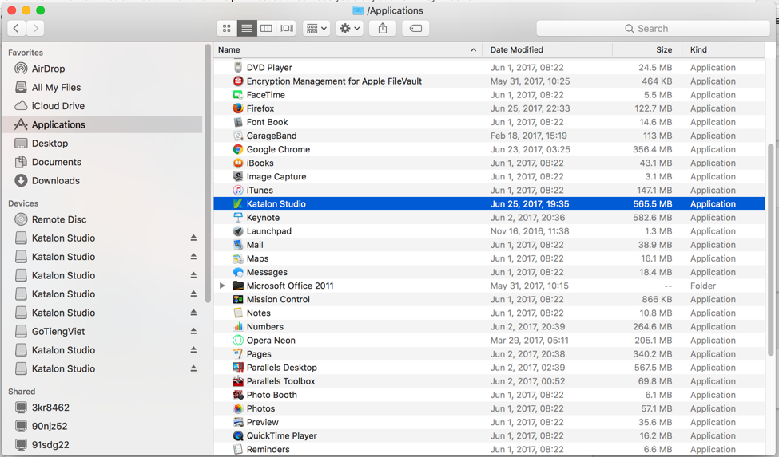

      > **对于 macOS Catalina 用户：**
      >
      > - 从 7.9 版开始，macOS Catalina 用户不再需要在**System Preferences**中启用 Katalon Studio 和 Katalon Studio Engine 应用程序。用户可以像在 macOS 中一样直接启动应用程序。

      - 启动后，应用程序应显示类似于以下屏幕截图的启动屏幕：

        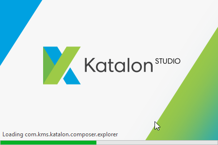

## 激活 Katalon Studio

1. Katalon Studio 应用程序启动，然后出现**Katalon Studio 激活**对话框。登录您的 Katalon 帐户以激活您的许可证。要了解有关许可证激活步骤的更多信息，请参阅[激活 Katalon Studio 许可证](https://docs.katalon.com/katalon-studio/docs/activate-license.html#activate-trial-license)。

   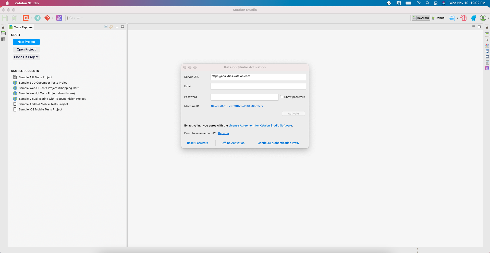

2. 完成后，单击**激活**。现在 Katalon Studio 可以使用了。

# 管理测试项目

> 在哪里创建测试？
>
> 选择您拥有所有读写权限的测试位置。 不要将您的项目存储在 Katalon 构建文件夹中。

## 创建一个测试项目

1.  从主菜单中选择 **文件 > 新建 > 项目**。在显示的**新建项目** 对话框中，选择所需的项目**类型**。

   - **通用端、网页端、移动端、桌面端**：Web、Mobile、API 和桌面测试的所有标准功能均可用。

   - **API / Web服务**：用于API独有的功能/ Web服务测试被使能，包括从输入测试请求的图标[的OpenAPI规范3.0](https://docs.katalon.com/katalon-studio/docs/import-openapi30.html)，[WADLs](https://docs.katalon.com/katalon-studio/docs/import-wadl.html)，[WSDL中](https://docs.katalon.com/katalon-studio/docs/import-soap-requests-from-wsdl.html)，[OpenAPI的规范2.0（[Swagger](https://docs.katalon.com/katalon-studio/docs/import-rest-requests-from-swagger-20.html))，和[Postman](https://docs.katalon.com/katalon-studio/docs/import-soapui.html); [请求历史列表](https://docs.katalon.com/katalon-studio/docs/request-history.html)等。

     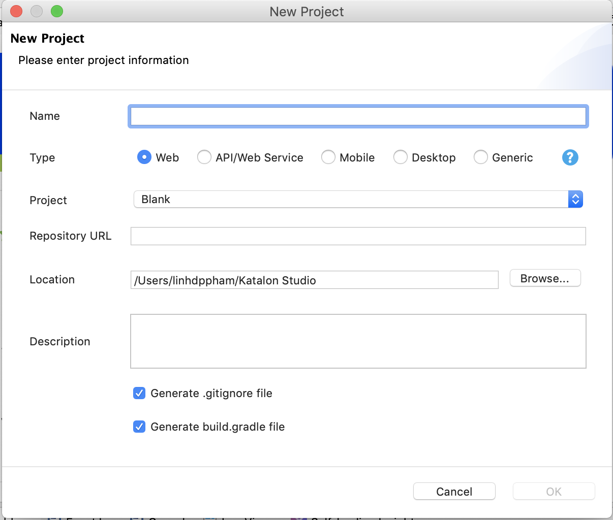

2. 为新项目指定**名称**、 **位置**和**描述**，然后单击**确定**。

   Katalon 将相应地生成一个项目。

## 打开现有的测试项目

1.  从菜单中选择 **文件 > 打开项目**。浏览到您的项目所在的文件夹并选择它。

   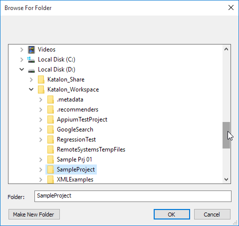

   2. 您还可以通过从“**文件”** 菜单下显示的列表中进行选择来快速打开最近的测试项目 ：

      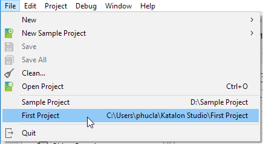

      ## 刷新项目

      如果项目文件已被修改且尚未反映在 Katalon Studio 中，您可以刷新项目以显示最新信息，如下图所示：

      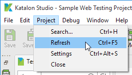

      ## 清理项目

      您可以通过删除 Katalon Studio 生成的临时文件来释放磁盘空间。这些临时文件存储在您机器的以下位置：

      | 操作系统 | 临时文件的位置                      |
      | :------- | :---------------------------------- |
      | Windows  | C:\用户\\AppData\Local\Temp\Katalon |
      | 苹果电脑 | /tmp/Katalon                        |

       在**File** 菜单下选择 **Clean...**， 如下图所示：

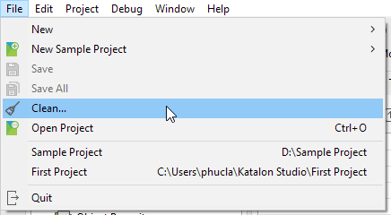

## 删除项目

要删除项目，只需关闭 Katalon Studio 并删除文件系统上的目录。

# [许可证概述]

# 许可证类型

> 从**版本 7.0.0**开始，您需要许可证才能激活和使用 Katalon Studio 产品之一，包括 Katalon Studio Enterprise (KSE)、Katalon Studio (KS) 和 Katalon Runtime Engine (KRE)。

本节提供有关 Katalon 许可系统的信息。您将找到 Katalon 产品及其可用许可证类型的说明。

## Katalon 工作室企业

Katalon Studio 提供适合个人测试需求的免费基本工具。对于高级业务解决方案，请考虑购买 Katalon Studio Enterprise 许可证。有关 KS 和 KSE 之间的功能比较，请参阅[Katalon Studio 与 Katalon Studio Enterprise Features](https://docs.katalon.com/katalon-studio/docs/katalon-studio-vs-katalon-studio-enterprise.html)。

一次可以在一台机器上激活和使用一个 KSE 许可证。许可证是可转让的。您需要 Internet 连接来激活和验证许可证，但适用特殊规则以启用离线激活。请参阅：[创建离线许可证](https://docs.katalon.com/katalon-studio/docs/use-online-license.html#create-an-offline-license)。

## Katalon 运行时引擎

Katalon Runtime Engine (KRE) 是 Katalon Studio 的测试执行插件。虽然 KSE 许可证仅支持您通过图形用户界面生成测试脚本和手动执行测试，但 KRE 许可证允许您在命令行界面 (CLI) 模式下执行自动化测试。

从 CLI 运行时，一个工作会话占用一个许可证。要了解有关 KRE 用例的更多信息，请参阅[Katalon 运行时引擎简介](https://docs.katalon.com/katalon-studio/docs/intro-RE.html)。

## 许可证类型

KSE 和 KRE 有两种类型的许可证：节点锁定和浮动。根据团队的规模、组成和工作要求，您可以选择购买节点锁定许可证、浮动许可证或两者的组合。

| **节点锁定许可证**                         | **浮动许可证**                                               |
| ------------------------------------------ | ------------------------------------------------------------ |
| 一个许可证分配给一个机器 ID。              | 一个许可证分配给一个执行会话，并且可以在多台机器之间共享。   |
| 许可证是可转让的。                         | 许可证是可转让的。                                           |
| 适用于具有固定硬件规格的本地桌面或工作站。 | 适用于所有类型的执行环境。                                   |
| 可在线订阅。                               | 可在线订阅。                                                 |
| 离线许可证可以从在线节点锁定许可证生成。   | 脱机许可证仅适用于本地许可服务器。如需更多信息，请[联系销售人员](https://www.katalon.com/book-a-demo/)。 |

### 节点锁定许可证

此许可证类型适用于具有固定硬件规格（机器阻止许可证）的本地桌面或工作站，例如：

- 具有固定机器 ID 的虚拟机
- 物理机

使用节点锁定许可证，一台运行测试的机器 = 一个许可证。

- 许可证与单个机器 ID 相关联，并且一次仅用于一个执行会话。
- 如果需要，一台机器可以映射到多个许可证。
- 对于连接到 Internet 的机器，可以根据需要多次免费将许可证转移到其他机器上。
- 仅适用于*年度许可证*：许可证可以转换为在离线环境中使用。转换后，许可证在过期之前不能转移到另一台机器上。

### 浮动许可证

对于动态使用扩展团队，浮动许可证可降低管理成本并优化您的工作流程。

此许可证类型适用于所有类型的执行环境，包括具有动态硬件规范的云或虚拟机（在 Docker、Azure、AWS 中执行测试）。

- 一个浮动许可证可以在多台机器上共享。
- 一次将一个浮动许可证分配给一个执行会话。

例如，您有 1 个浮动 Katalon Studio Enterprise 许可证附加到电子邮件[example@katalon.com](mailto:example@katalon.com)。

您可以使用[example@katalon.com](mailto:example@katalon.com)在多台不同的机器上登录 Katalon Studio，但不能同时登录。这是因为 [example@katalon.com](mailto:example@katalon.com)仅代表 1 个浮动 Katalon Studio Enterprise 许可证。因此，您一次只能在其中一台机器上处于活动状态。

