# API 测试简介

本文旨在提供 API 测试的概述，并坦诚地回答 What – When – Why 问题，希望能够揭示隐藏在测试边界内的这片神秘土地 – 工程领域。

您还将发现 API 测试实施的潜在挑战——最佳实践以及如何选择正确的工具集来帮助您以更高的成功机会实现 API 测试。

## 什么是 API 测试？

API 测试是一种软件测试，涉及直接测试应用程序编程接口 (API)，并将其作为集成测试的一部分，以确定它们是否满足对功能、可靠性、性能和安全性的期望。由于 API 缺少[GUI](https://en.wikipedia.org/wiki/Graphical_user_interface)，API 测试在消息层执行，可以非常快速有效地验证应用程序逻辑。

API 测试对于自动化测试和 CI/CD 过程至关重要，因为它可以应对较短的发布周期和频繁的更改，尤其是表示层，而不会破坏测试输出。与 UI 自动化测试相比，API 测试还需要更少的维护工作，这使其成为敏捷和 DevOps 团队的首选。

附带说明一下，对于 Web 和移动应用程序，API 通常意味着 Web 服务，而 API 测试是指对 Web 服务执行的自动化测试。

## API 测试在哪里进行？

通常，应用程序具有三个独立的层或层，包括表示层或用户界面、用于业务逻辑处理的业务层或应用程序用户界面，以及用于建模和操作数据的数据库层。

API 测试在最关键的层执行，业务层执行业务逻辑处理，用户界面和数据库之间的所有事务都发生。

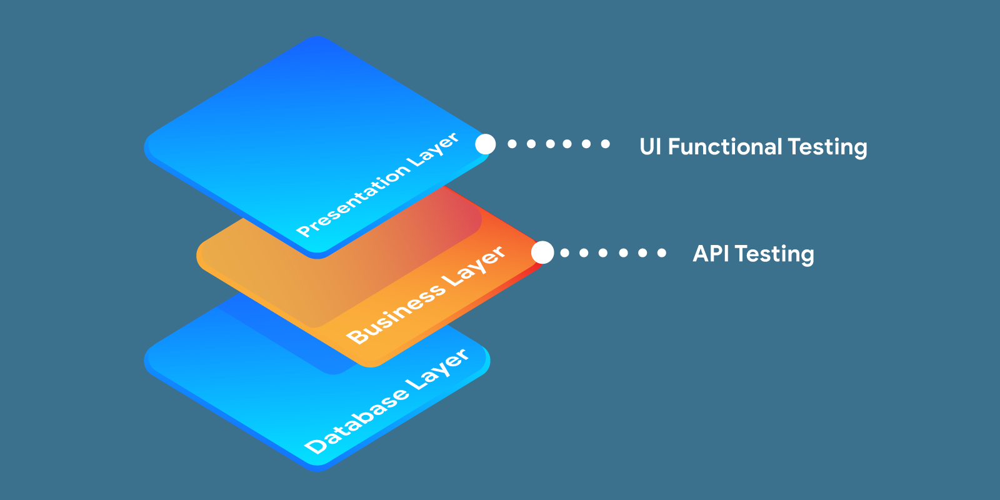

## 为什么我们需要进行 API 测试？

下图显示了三个不同的测试层，称为[测试金字塔](https://martinfowler.com/articles/practical-test-pyramid.html)，最初由 Mike Cohn 在他的《敏捷的成功》一书中提出。它具有代表不同类型测试的层。尽管它过于简单，但它为我们提供了一个通用的经验法则：它建议我们应该在每一层关注多少测试。因此，第二层的 API 和服务测试是我们应该关注的重要测试活动。

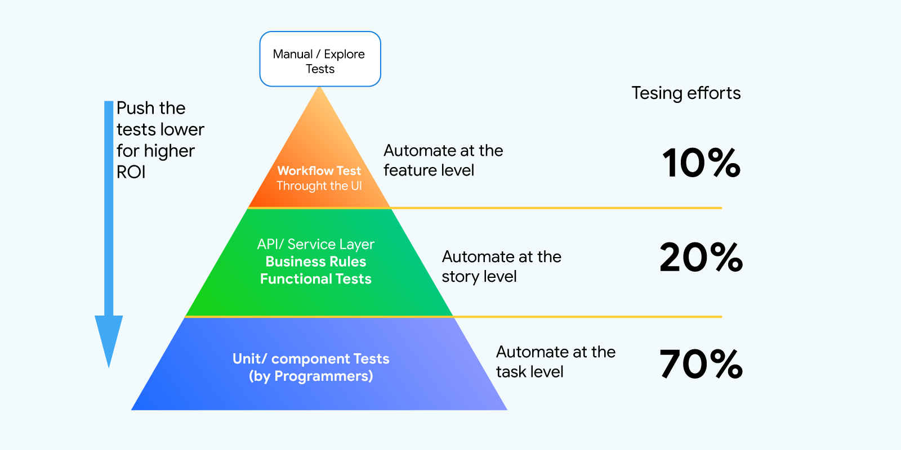

单元/组件测试：这种最低级别的测试带来了最高的价值和投资回报率。它主要由开发人员执行。单元/组件测试可以达到 70% 到 80% 的代码覆盖率，并且需要付出同样多的努力。

业务规则/功能测试：此级别的测试侧重于被测应用程序的业务规则。这些测试旨在针对用户故事进行测试，以确保所有实现的功能都按预期工作。在 Web 和移动应用程序中，用户界面中显示的数据通常是通过 API/服务从服务器返回的。因此进行 API 测试以确保 API/服务的准确性。此级别的测试可能需要大约 20% 的总测试工作量。

工作流测试（通过 UI）：功能 UI 测试通过应用程序的 UI 执行，以确保其功能按预期构建。由于自动化功能 UI 测试很脆弱，并且 UI 中的任何更改都可能破坏测试，因此测试自动化团队应该较少关注这一级别的测试。

与测试人员执行的所有其他测试类型相比，API 测试产生的投资回报率最高，因为单元测试主要由开发人员执行。与其他类型的测试相比，它还具有许多优势：

## API 测试的优势

如上所述，API 测试是测试团队应该关注的一项重要活动。与其他类型的测试相比，它具有许多优势：

- 独立于语言：数据通过 XML 和 JSON 交换，因此任何语言都可以用于自动化，独立于用于开发应用程序的语言。XML 和 JSON 通常是结构化数据，因此验证快速且稳定。还有内置库支持使用这些数据格式比较数据。

- GUI 独立：我们可以在 GUI 测试之前在应用程序中执行 API 测试。早期测试将更快地获得反馈并提高团队的生产力。可以测试核心功能以暴露小错误并评估构建的优势。

- 提高测试覆盖率：大多数 API/服务都有规范，允许我们创建具有高覆盖率的自动化测试，包括功能测试（快乐案例、负面案例）和非功能测试。使用虚拟用户技术，我们很少能找到无法自动化的 API 测试用例。

- 更快的发布：执行 UI 回归测试套件通常需要 8-10 小时，而使用 API 测试的相同场景只需 1-2 小时。API 测试的脆弱性也低于 UI 测试。所有这些使我们能够通过 API 测试更快地发布。

  

## API 测试类型

API 测试通常分为以下常见类别：

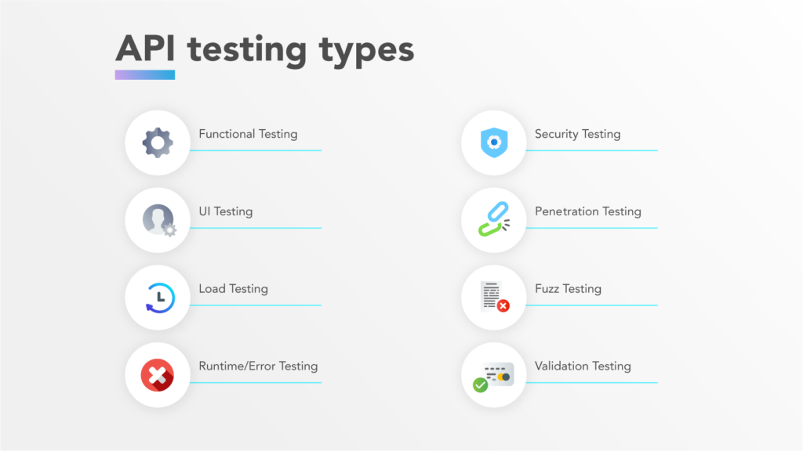

### 验证测试

验证测试是最后的步骤之一，在开发过程中起着至关重要的作用。验证测试有助于验证产品、行为和效率的各个方面。换句话说，验证测试可以被视为针对所陈述的用户需求和要求进行正确开发的保证。

### 功能测试

功能测试包括对代码库中特定功能的测试。这些功能是特定场景的表示，以确保 API 功能在计划的参数内得到很好的处理。

### 端到端测试

UI 测试被定义为对 API 和其他组成部分的用户界面的测试。它主要是关于 UI 功能，其中界面自然是图形或依赖命令行端点调用。

通常，测试更有可能是与 API 相关的接口，而不是 API 测试本身。虽然 UI 测试在代码库方面不是对 API 的特定测试，但这仍然提供了有关前端和后端的健康、可用性和效率的概述信息。

### 负载测试

负载测试通常在特定单元或整个代码库完成后进行，以检查理论解决方案是否符合实际计划。执行负载测试以确保在正常和峰值条件下的性能。为此，负载测试需要一些不同的场景：

- 基线——根据 API 在日常使用中预期的理论常规流量测试 API；
- 理论最大流量——这是为了确保在满载期间，解决方案正确响应这些请求；
- 过载测试——根据理论测试最大能力，然后在峰值流量上增加 10-20%。  

### 运行时/错误检测

这种测试类型与 API 的实际运行有关，特别是与使用 API 代码库的普遍结果有关。通常，他们专注于以下方面之一：

- 监控：针对不同的实现错误、处理程序故障和其他内在问题对编译代码的运行时进行测试，以帮助确保代码库不包含任何不安全性。
- 执行错误：代码需要显示对有效请求的响应，并以可预测和已知的方式标记无效请求的失败，与有效请求相同。
- 资源泄漏：无效或通常非法的请求将被提交到 API 以测试内存、资源、数据或操作泄漏/不安全性
- 错误检测：已知的故障场景将用于测试代码，以确保错误得到适当的计算和解决

### 安全测试

安全、渗透和模糊测试是安全审计过程的三个独立元素。它们用于确保 API 实现免受外部威胁。

除了包含渗透和模糊测试之外，安全测试还包括其他步骤，例如验证加密方法和 API 访问控制的设计。它还包含用户权限管理和验证授权检查以访问资源。

### 渗透测试

如果审计，渗透测试被认为是过程中的第二个测试。在这种测试类型中，API 知识有限的用户会尝试从外部角度评估威胁向量，即功能、资源、流程或针对整个 API 及其组件的攻击。

### 模糊测试

模糊测试是整个安全审计过程中的另一个步骤。在这种测试类型中，大量的随机数据（称为“噪声”或“模糊”）将被输入到系统中，旨在尝试强制崩溃或任何负面行为。这个模糊测试将帮助测试 API 的限制，为“最坏的情况”做准备。

## API 测试最佳实践

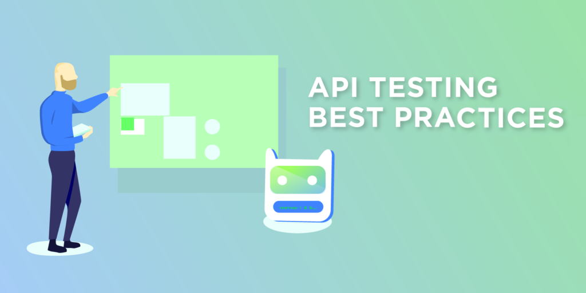

### 优先事项

在开始开发测试场景时，我们中的一些人比较常见的是直接跳入一些负面的测试场景（验证无效信息、特殊字符验证、不常见输入等）。这些类型的验证可能会导致崩溃和其他有趣的问题。换句话说，在负面测试场景中可能会很快发现简单的错误。不幸的是，这不一定是测试人员努力的最佳方式。建议优先关注主线场景，优先级更高。一个基本准则是确定最终开发人员在调用 API 时将使用的最常见参数和条件，并广泛测试这些场景。

### 功能和非功能测试优先级

API是现代Web应用程序的重要组成部分，其性能、安全性、连接性等非功能性方面将对系统产生重大影响。这种行为使传统的测试思维方式，首先关注功能测试，不再适用。功能性和非功能性测试应以同等优先级同时进行。

### 端点管理

  一个典型的产品可能有数百个 API/Web 服务端点，它们看起来非常相似，并且可能会导致测试项目出现重复问题。您如何组织测试和端点将影响测试的生产力、有效性和维护。

  测试端点可以按路径（包括路径参数）分组，这通常对特定对象类型执行操作。举些例子：

```
api/2/issue: affects to Jira issue
   -- Create issue
   POST /rest/api/2/issue
   -- Create issues
   POST /rest/api/2/issue/bulk
   -- Get issue
   GET /rest/api/2/issue/{issueIdOrKey}
```

尽管

```
api/2/group: affects to Jira Group
   -- Create group
   POST /rest/api/2/group
   -- Get group  DEPRECATED
   GET /rest/api/2/group
   -- Remove group
   DELETE /rest/api/2/group
```

此方法将帮助我们防止丢失测试端点和测试场景。

### 端点作为模板

  这个端点是[数据驱动方法](https://docs.katalon.com/katalon-studio/tutorials/data-driven-testing/)的一部分，它与数据模型相关的不仅仅是输入数据。API 测试中最具挑战性的问题之一是测试数据与数据模型（数据模型的子集）的映射。举些例子：

  创建新 Jira 问题的 API 需要具有必填字段（如项目密钥、摘要）和非必填字段（如描述、受让人等）的输入数据模型。应测试必填和非必填字段的所有组合，以确保涵盖所有测试场景。对于每种组合，我们然后应用数据驱动来测试不同的数据集。

  这种做法建议我们将每个组合视为端点的测试模板，然后对该测试模板应用数据驱动的方法来生成实际的可执行测试场景。

### 数据驱动

  任何 API 测试工具最重要的特性是数据驱动方法的能力。缺乏数据驱动能力会导致测试数据硬编码、重复测试脚本、测试验证，从而导致维护阶段的大量工作。

  和数据驱动一起，对于测试数据还有一些重要的注意事项是我们要认真注意的：数据类型、空白、空、空字符串。对于 RESTful Web 服务，输入数据通常采用 JSON 格式，在某些情况下，特定键的缺失值被视为不同（null、空）。为了避免这些模棱两可的测试场景，强烈建议使用输入数据模型的子集。

## API 测试中的挑战

### API 测试的初始设置

在 API 测试中，手动和自动测试都很重要。虽然手动测试可以确认应用程序是否正常工作，但自动化测试有助于检查应用程序在压力下的执行效率。设置测试基础设施使其工作被认为是测试过程中最具挑战性的任务之一，因为它不仅特别棘手，而且是一个显着的激励杀手。但是，一旦团队完成了那些具有挑战性的设置过程，这将是一个长期的好处。

为了避免这些挑战，团队需要在早期阶段开始 API 测试，特别是在设计阶段，并确保对 API 进行间隔检查，以实现 100% 的正常运行时间。

### 更新 API 测试的 Schema

架构（处理 API 请求和响应的数据格式）应在测试过程中维护。程序中为 API 调用创建附加参数的任何更改都必须反映在模式配置中。

在当今的 API 经济中，API 的变化有助于促进需求，但这些变化可能会导致停机。为了避免这个问题，团队需要在 beta 和 alpha 环境中测试 API，这样可以减少 90% 的问题发生机会。

### 测试参数组合

API 通过将数据值分配给参数并通过数据请求传递这些参数来处理系统之间的通信。测试 API 中所有可能的参数请求组合对于检测与特定配置有关的问题是必要的。一个更重要的项目最终会为同一个参数分配两个不同的值，或者创建在文本值应该出现的情况下出现数值的实例。添加参数将大大增加可能组合的数量。

这个挑战可以通过选择一些对日常操作不是很关键的应用程序来利用 API 并将其仅发布到这些应用程序来解决。通过这样做，测试人员可以了解 API 是如何使用的，以及是否应该对通用版本进行任何更改。

### 对 API 调用进行排序

当 API 需要按特定顺序正常工作时，这对测试团队来说是一个挑战。例如，在创建配置文件之前调用返回用户的配置文件信息，该请求将返回错误。当涉及更多应用程序时，该过程可能变得更加困难。

为了帮助克服这个问题，建议使用流程图来可视化 API 调用。然后，开发人员可以更快地构建和集成 API 调用，减少意外问题。

### 验证参数

软件测试团队可能会发现使通过 API 请求发送的参数无效具有挑战性，因为这些参数的参数和用例数量众多。测试人员需要确保所有参数数据使用正确的字符串或数字数据类型、符合长度限制、符合指定值范围并通过其他验证标准。

为了解决这个问题，测试团队可以使用持续的综合 API 监控来及早发现问题。此外，它应该与 APM 解决方案相结合以获得 360 度视图。

### 跟踪系统集成

确保 API 测试系统与数据跟踪系统正常工作是 API 测试中的另一个挑战。这种集成对于恢复有关呼叫是否正常工作的适当响应至关重要。它在监控 API 性能方面也很有用。跟踪系统集成是整个过程的后期阶段，导致团队没有给予足够的重视。

从设计阶段开始就可以通过计划来改进它，以了解它将如何与其他系统集成。每个应用程序都有各种需要满足的要求。因此，团队不应与其他关键集成系统并行测试。这可以通过在持续交付中实施和添加负载测试来实现。

查看更多：

- [使用 Katalon Studio 创建您的第一个 API 测试](https://docs.katalon.com/katalon-studio/tutorials/create-first-api-test-katalon-studio/)
- [API/Web 服务项目](https://docs.katalon.com/katalon-studio/docs/apiweb-service-project-since-v58.html)
- 在 Katalon Academy 上学习此课程：[利用 API 使用 Katalon 和 LambdaTest 促进 Web 测试](https://academy.katalon.com/courses/api-boost-web-testing-lambdatest/?utm_source=kat_docs_api_intro&utm_medium=bottom_link&utm_campaign=academy_promotion)


# 使用 Katalon Studio 创建您的第一个 API 测试

## 介绍

**API 测试**（或 Web 应用程序上下文中的 Web 服务测试）在软件测试中变得越来越重要。[根据Google Trends](https://trends.google.com/trends/explore?date=today 5-y&q=api testing)的数据，在过去五年中，人们对 API 测试的兴趣一直在增加。这种趋势可能表明应用 API 测试的需求变得更加普遍。测试 API 或 Web 服务不再仅由原始开发人员执行。此活动现在是独立验证和验证其产品的外包团队的常见做法。

本教程将演示如何使用 Katalon Studio 通过良好实践从头开始创建您的第一个 API/Web 服务测试。

## 安装和设置 Katalon Studio

请参阅指南了解所有基本步骤，从下载到激活构建[安装和设置 Katalon Studio](https://www.katalon.com/resources-center/tutorials/web/get-started/install-setup-katalon-studio/)。

## 创建新项目并设置 API 自动化测试

### 步骤 1：创建一个新项目

- 转到**文件**->**新建**->**项目**并输入项目名称及其位置以启动新项目。

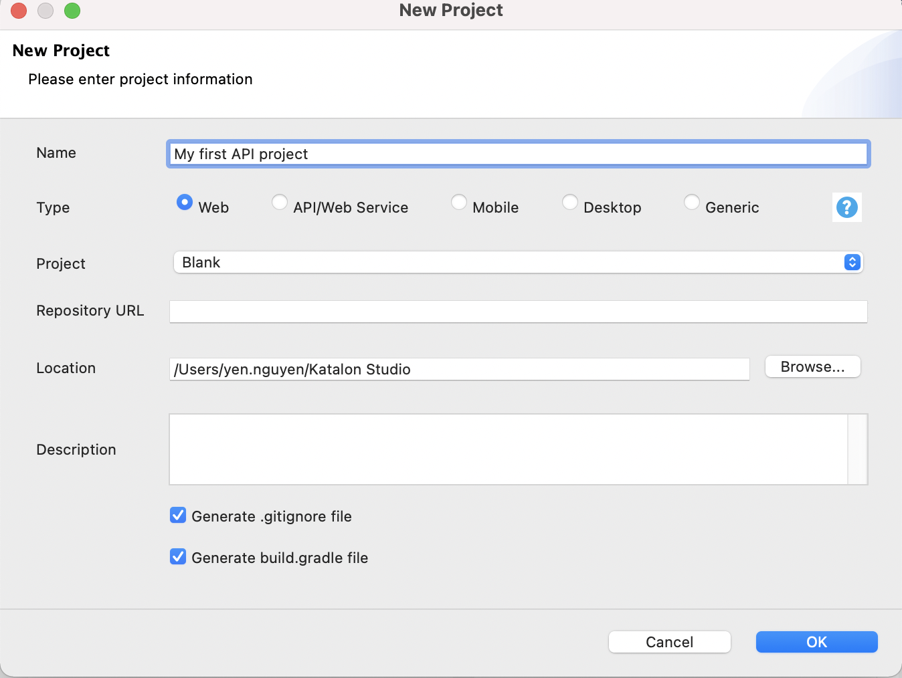

- 确认项目创建后，我们会在**Tests Explorer**中看到一个文件夹结构，这个文件夹系统负责保存所有的测试资源，也是我们开始第一次API测试的地方。

### 第 2 步：创建第一个 API 测试

在创建我们的第一个 API 测试之前，让我们看一下我们用于设置测试项目的格式。

**对象存储库**

- 对象存储库是存储所有 Web 服务端点以及请求方法、URL、标头、内容和身份验证的所有信息的地方。
- Object Repository 中的 Web 服务测试对象由文件夹系统集成，以便更好地管理。

**测试用例**

- 测试用例存储所有测试场景并按文件夹系统分组。每个测试用例都包含几个说明测试场景的步骤。
- 我们可以使用指定的执行配置文件单独执行测试用例。

**测试套件**

- 测试套件是存储所有测试套件的地方。测试套件是验证特定目标的测试用例的集合。
- 测试套件级别的测试用例可以使用数据驱动的方法执行。
- 测试报告也在测试套件级别生成

**测试套件集合**

- 测试套件集合是验证更大目标的测试套件的集合。
- 测试套件集合级别的测试套件具有指定的特定测试环境。

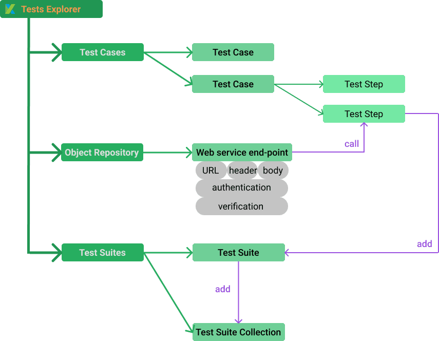

### 第 3 步：在对象存储库中创建一个新的 RESTful 端点

**对象存储库**->**新建**-> **Web 服务请求**

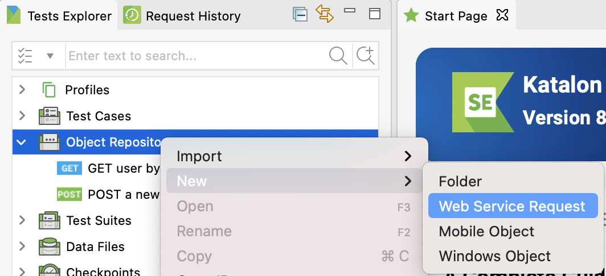

Katalon Studio 将用于测试的 Web 服务端点存储在**Object Repository**中，类似于UI Test 中的**Test Object**。在**Create New Web Service Request**对话框中，您可以选择创建 RESTful 或 SOAP 请求。

**请求类型**是必填字段。您需要在此步骤中准确指定它。相反，**URL**不是必需的。您可以稍后在下一步中设置此值。

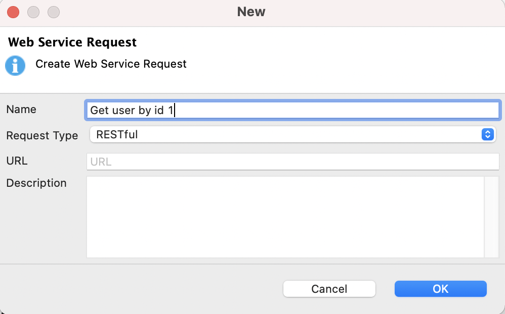

单击**OK**，然后我们准备为第一个 RESTful 测试输入更多详细信息。

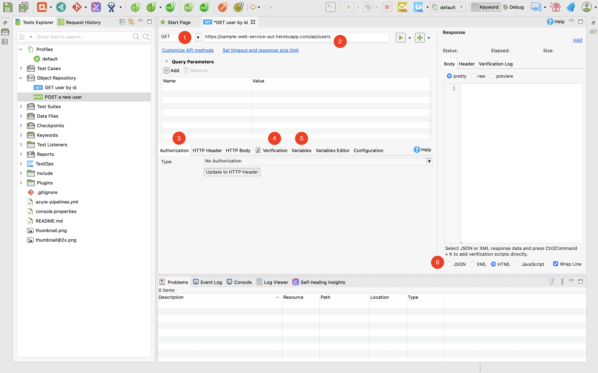

测试 RESTful 请求时需要指定一些重要概念：

**(1) 请求方法**

我们可以为您的第一个请求测试选择以下方法之一：**GET、POST、PUT、DELETE**。该方法需要与 URL 匹配才能获得有效请求。例如，假设我们的第一个测试是来自 Jira Cloud 版本的公共 API。我们应该使用**GET**方法使用其 ID 接收现有票证的信息。

**(2) 请求网址**

与请求方法一起，**请求 URL**用于告诉 Web 服务器在测试中使用了哪个 API。方法和 URL 的任何不匹配都会导致运行时的无效请求异常或错误的数据响应。

**(3) 授权**

授权是 API 的重要组成部分。它用于在许可下获取正确的数据（除非数据是公开的）。Katalon Studio 支持常见的身份验证方法：

基本方法需要用户名和密码。不要忘记单击**Update to HTTP Header**以便将身份验证应用于**HTTP Header**。

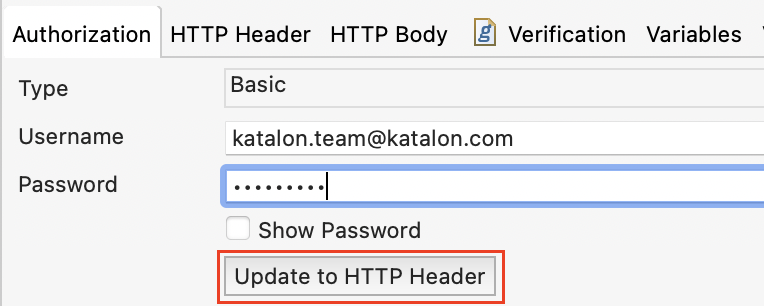

**(4) 验证**

验证是您定义断言以确保响应将包含预期信息的地方。

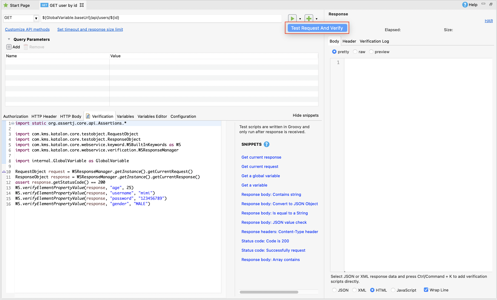

请求的验证选项卡类似于测试用例的脚本选项卡。换句话说，您可以使用内置关键字或 Groovy/Java 脚本编写自定义脚本来验证响应数据。除了内置关键字，Katalon Studio 还支持内置片段，可帮助您通过单击生成断言。对于可能发现难以处理解析和断言 JSON 数据格式的测试人员来说，它很有用。

请求的右侧面板是自动以nice格式显示的响应和验证日志中的验证结果。要在发送请求时包含验证脚本，您需要从执行按钮中选择**测试请求和验证选项。**

验证脚本可帮助您快速反馈请求状态，而不是实际测试。您可以在下一步中向测试用例级别添加更多断言。

**(5) 变量**

通过数据驱动的方法，变量使 API 测试更加健壮和动态。在 Katalon Studio 中，请求的每个部分都可以参数化。换句话说，动态数据可用于：URL、身份验证、HTTP Header 和 HTTP Body，以最大限度地发挥数据驱动测试的能力。以下设置与上面的示例相同：

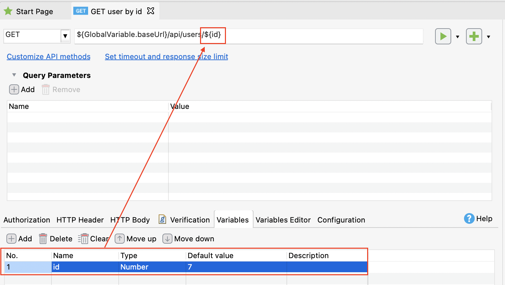

**(6) 格式化程序**

响应将自动以简洁的格式显示：JSON、XML、HTML 和 JavaScript。这有助于快速查看响应状态。

### 第 4 步：使用现有请求创建新的测试用例

虽然**Object Repository**的请求有助于快速测试，但我们可以在测试用例级别添加请求验证，以便更好地管理和报告。

### 第 5 步：将现有请求添加到测试用例

可以使用 Web 服务内置关键字将请求插入到测试用例中。有许多关键字可用于发送请求、验证响应以及将请求作为更大测试流程的一部分。

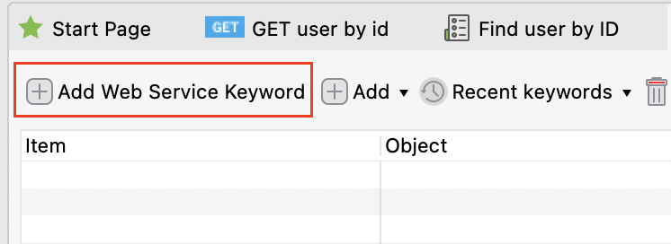

以下测试用例说明了我们如何使用测试用例中的验证步骤调用请求：


测试用例可以在 Katalon Studio 中作为普通测试用例执行。可以从日志中查看每个验证步骤。

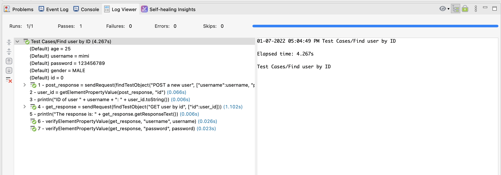

### 第 6 步：将测试用例添加到测试套件

可以通过拖放功能或**添加测试用例**工具将测试用例添加到测试套件中。将测试用例添加到测试套件后，我们可以使用 Run 按钮执行整个测试套件（无需像在 UI 测试中那样选择浏览器）。

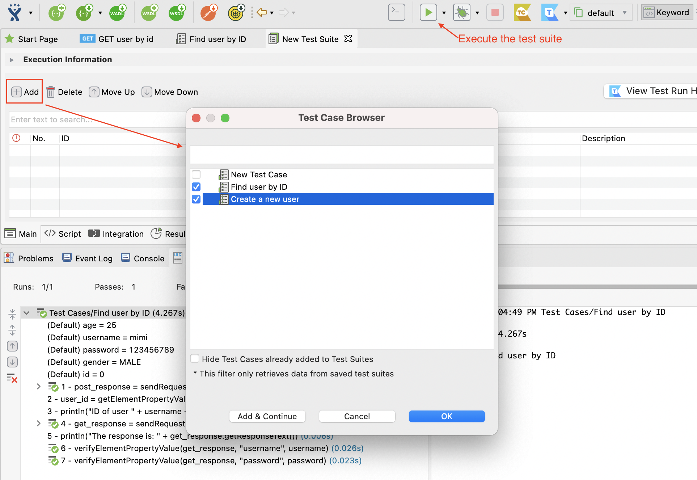

### 下一步

现在我们完成了第一个测试的创建。为了使用实用的解决方案为真实项目创建测试，我们需要使用更多技术创建更多测试：

- 参数化你的测试
- 应用数据驱动的方法
- 创建自定义关键字/包
- 调用测试和重用代码
- 包括错误处理
- 测试套件执行后查看测试报告

### 创建自定义 API/Web 服务方法

> 此功能仅适用于 Katalon Studio Enterprise 用户。

您可以通过转到**Project > Settings > Test Design > Web Service > Custom Method创建****自定义 API/Web 服务方法**来扩展 RESTful Web 服务测试功能。Katalon 在默认支持的方法集之上处理自定义 API 方法。

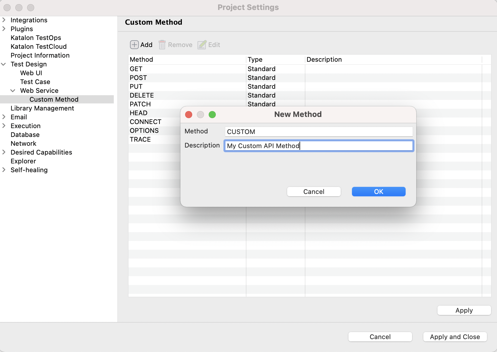

## 结论

这个完整的教程帮助我们完成了用户创建第一个 API 测试所需的所有步骤和概念。为了达到最佳结果并节省时间和精力，我们必须学习如何正确使用 API 测试。例如，我们需要对技术进行适当的实现，并了解 API 是应该自动测试还是手动测试。因此，如果我们付出足够的努力并掌握了您的 Katalon Studio 技能，该工具肯定会帮助我们显着提高任何目标产品的质量。

