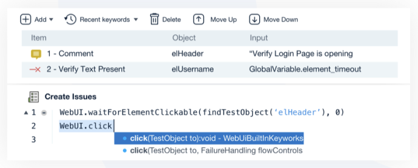
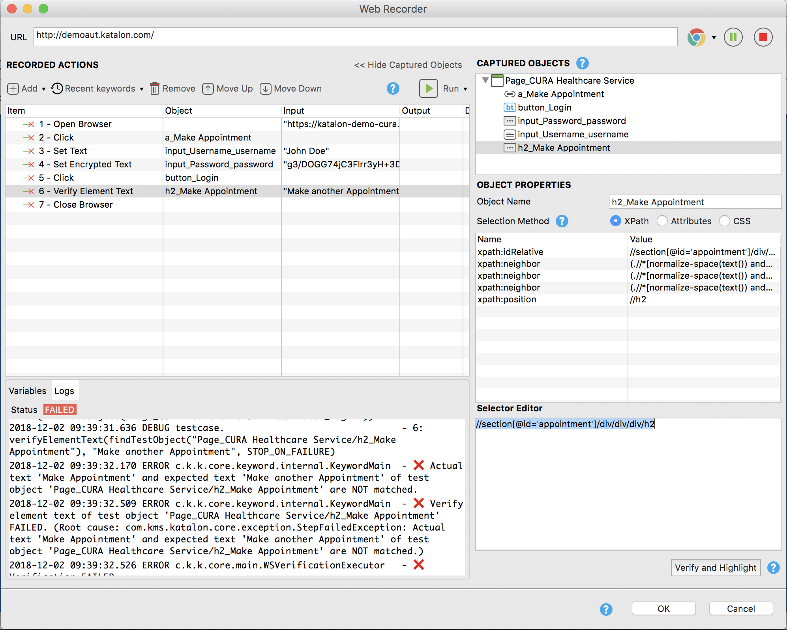
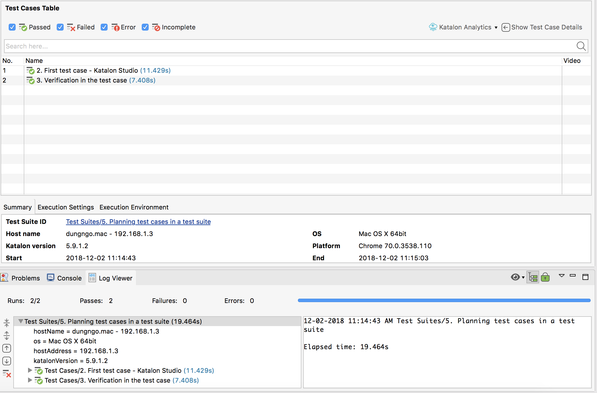

# Web 测试简介

这是关于如何开始使用 Katalon Studio 进行测试的基本教程。如果您是 Katalon Studio 的新手或刚刚开始使用该应用程序进行测试，那么此“入门”文档适合您。我们将介绍 Katalon Studio 中的几个主要步骤、基本概念和操作。您将学习如何创建项目、创建、验证、调试以及成功计划和执行测试用例。

## 在你开始之前

Katalon Studio 简单易用，即使对于没有太多编程和脚本编写经验的用户也是如此。如果您是 Katalon Studio 的新手，但有一些基本的 Java 或 Groovy 技能，并且对测试有一个简短的了解，那么使用这个工具应该没有问题。

- 首先，您需要验证您的计算机是否满足 Katalon Studio 的[系统要求](https://docs.katalon.com/katalon-studio/docs/system-requirements.html)。
- 有关如何安装和设置 Katalon Studio，请在[此处查看](https://docs.katalon.com/katalon-studio/tutorials/install_setup_katalon_studio.html)。

## 做好准备！

**第 1 步：设置项目**

在 Katalon Studio 中，您可以从头开始，或从我们提供的[示例项目](https://github.com/katalon-studio-samples)之中选择一个来创建新项目。转到文件 > 新建 > 项目并选择您的偏好。然后输入新项目的名称和存储项目数据的位置。

此外，本教程中的所有 Katalon Studio 代码都包含在入门示例中，您可以将其用作参考。

**第 2 步：创建第一个测试用例**

右键单击*测试用例 > 新建 > 测试用例*

Katalon Studio 中的测试用例可以用纯 Selenium 格式编写：

```
WebDriver driver = new ChromeDriver();
String baseUrl = "https://www.katalon.com/";
driver.manage().timeouts().implicitlyWait(30, TimeUnit.SECONDS);
driver.get("https://katalon-demo-cura.herokuapp.com");
driver.findElement(By.id("btn-make-appointment")).click();
driver.findElement(By.id("txt-username")).clear();
driver.findElement(By.id("txt-username")).sendKeys("John Doe");
driver.findElement(By.id("txt-password")).clear();
driver.findElement(By.id("txt-password")).sendKeys("ThisIsNotAPassword");
driver.findElement(By.id("btn-login")).click();
driver.quit();
```

单击*“运行”*以查看其工作原理。

但是，编写测试用例——尤其是一次编写大量测试用例——可能会很耗时。如果 Selenium 不是您的首选，请不要担心。上述测试用例，如果以 Katalon Studio 的标准格式编写，将如下所示：

```
WebUI.openBrowser('https://katalon-demo-cura.herokuapp.com/')
WebUI.click(findTestObject('Page_CURA Healthcare Service/a_Make Appointment'))
WebUI.setText(findTestObject('Page_CURA Healthcare Service/input_Username_username'), 'John Doe')
WebUI.setEncryptedText(findTestObject('Page_CURA Healthcare Service/input_Password_password'), 'g3/DOGG74jC3Flrr3yH+3D/yKbOqqUNM')
WebUI.click(findTestObject('Page_CURA Healthcare Service/button_Login'))
```

单击*“运行”*以查看其工作原理

Katalon Studio 的开始步骤似乎相对不言自明。但是，您可能想知道“ChromeDriver”在哪里，“click”和“findTestObject”方法是什么，或者如何使用“Page_CURA Healthcare Service/a_Make Appointment”参数。让我们一起来看看。

浏览器驱动程序（例如 Katalon Studio 中的 ChromeDriver）从代码中抽象出来，并在执行时进行设置，以使代码本质上可以跨浏览器。

“Click”和“setText”是 Katalon Studio 的[开源内置关键字](https://github.com/katalon-studio/katalon-studio-testing-framework)，它们包装和增强了有限的 Selenium 关键字集。您还可以定义自己的[自定义关键字](https://docs.katalon.com/katalon-studio/tutorials/create_custom_keyword.html)集或导入其他 Katalon Studio 用户制作的共享自定义关键字。

“Page_CURA Healthcare Service/a_Make Appointment”是 Katalon Studio 中的一个[测试对象](https://docs.katalon.com/katalon-studio/docs/manage-test-object.html)，旨在遵循页面对象模型模式。它有助于集中应用程序元素，以便更轻松地编写脚本和维护脚本。最重要的是，Katalon Studio 最近开发了“自动修复”——尽管 AUT 的性质不断变化，但该功能使测试对象具有可持续性。最终，上述脚本和对象可以通过[“录制”](https://docs.katalon.com/katalon-studio/docs/record-web-utility.html)和[“间谍”](https://docs.katalon.com/katalon-studio/docs/spy-web-utility.html)功能快速生成。

您还可以使用 Katalon Studio 来执行这两种手动测试。该工具独特地为手动和自动测试提供了双脚本界面：



为了付诸实践，测试人员和开发人员团队将这些步骤应用于完整的工作流程如下：自动化专家准备所有脚本工作，例如自定义关键字、[测试侦听](https://docs.katalon.com/katalon-studio/docs/test-listeners-test-hooks.html)器、[调用测试用例](https://docs.katalon.com/katalon-studio/docs/call-test-case.html#call-test-case-in-manual-view)等。然后，手工QA工程师们-不熟悉脚本的人——可以利用所有准备好的材料来构建测试用例。最终，手工QA 可以逐渐学习如何编写脚本并成为自动化脚本编写者。

**第 3 步：在测试用例中进行验证**

接下来，让我们在测试用例中添加验证脚本，以了解登录过程是否成功。

从第一个测试用例开始，我们就了解了 Katalon Studio 脚本的基本工作原理。现在让我们进一步使用“Make Appointment”标头验证创建一个更真实的测试用例。

Katalon Studio 提供了一组丰富的验证关键字来轻松处理该要求。换句话说，这种脚本可以在手动或脚本模式下完成。


```
- WebUI.verifyElementText(findTestObject('Object Repository/Page_CURA Healthcare Service/h2_Make Appointment'), 'Make Appointment', FailureHandling.STOP_ON_FAILURE)
```

之后，可以在[Log Viewer](https://docs.katalon.com/katalon-studio/tutorials/viewing_execution_logs.html)中查看执行结果。要了解如何查看执行日志，请访问此[文档](https://docs.katalon.com/katalon-studio/tutorials/viewing_execution_logs.html)。


**第 4 步：调试测试用例**

让我们通过将验证文本更改为“Make another Appointment”来故意使测试用例失败。在 Katalon Studio 中，有几种方法可以检查失败原因。

**选项 1：调查错误日志**


**选项 2：调试模式**

为了研究复杂的场景，Katalon Studio 提供了一种调试机制，其工作方式与高级开发人员 IDE 中的代码调试机制相同。


**选项 3：手动调试**

Katalon Studio 的“录制”功能也有自己的调试方法。您可以继续记录失败的测试用例，运行错误测试步骤，然后直接在记录模式下调查并修复问题。请参阅以下示例：




**第 5 步：在测试套件中规划测试用例**

右键单击*测试套件 > 新建 > 测试套件*

[测试套件](https://docs.katalon.com/katalon-studio/docs/design-a-test-suite.html)用于计划具有多种配置的测试用例，例如：重试失败、电子邮件发送或数据驱动绑定。**您可以通过展开执行信息**部分来管理测试套件执行的其他配置，如下所示：


欲了解更多详情，请访问[此处](https://docs.katalon.com/katalon-studio/docs/design-a-test-suite.html)。

**第 6 步：执行测试套件并查看结果**

选择*测试套件 > 单击运行*

最后一步是在设计的测试套件中执行测试用例。以下是执行测试用例的方法：一旦计划好，测试套件或测试套件集合不仅可以直接在 Katalon Studio 中执行，还可以通过[命令行执行](https://docs.katalon.com/katalon-studio/tutorials/generate_command_line.html)。连同执行结果的标准 JUnit 格式和[预构建的 Docker 映像](https://github.com/katalon-studio/docker-images)，这些功能将使您能够充分灵活地使用 Jenkins 或 CircleCI 等工具将 Katalon Studio 集成到 CI/CD 管道中。



## 下一步

恭喜！现在您已经了解了使用 Katalon Studio 的第一步和基本步骤。完成第一个测试项目后，请继续阅读我们的教程和指南以了解更多信息。

