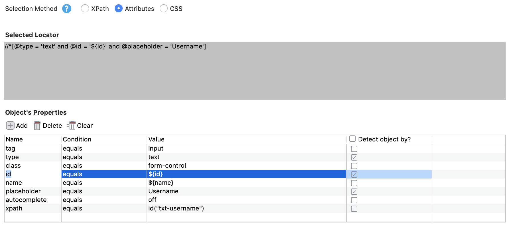
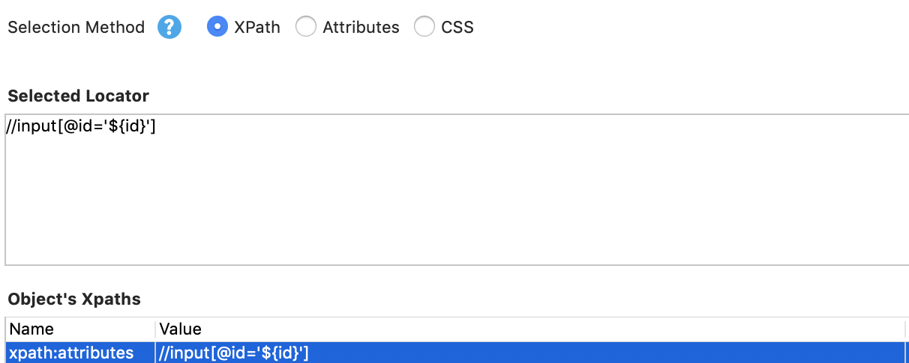
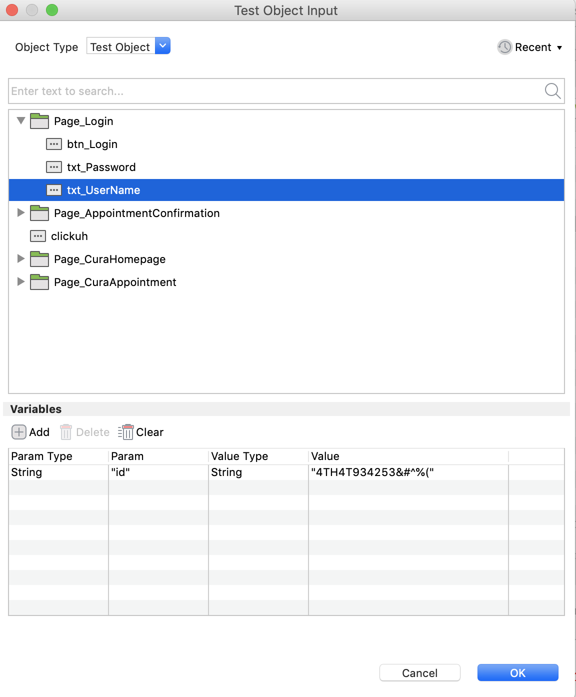
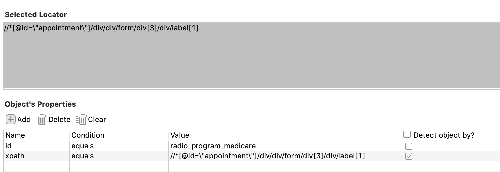
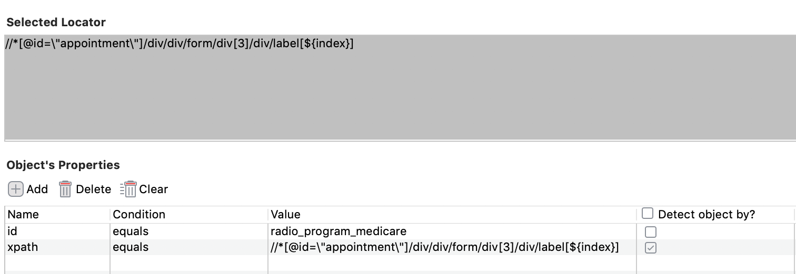

# 参数化Web测试对象
## 参数化Web测试对象及其属性
通过参数化测试对象，您可以通过使用局部或全局变量动态地更新测试对象的定位器。这个特性在以下用例中派上用场:
* 您希望对一组类似的元素执行批量操作，而不需要定义多个测试对象，例如检查多个复选框;

* 您只能在运行时识别一个对象的定位器，因为有一组类似的对象，而所选择的对象不能在测试脚本中预先指定。

Katalon Studio支持参数化测试对象的属性来处理动态对象。动态对象是那些基于特定业务规则在其属性中有一些特定更改的对象。下面的示例描述了如何应用该特性。

打开“医疗保健”示例项目，导航到对象存储库/Page_Login。
1. 选择要参数化其属性的对象。在本例中，选择的测试对象是txt_Username。
2. 捕获它的定位器，并使用${variable_name}语法创建一个变量作为其动态属性的占位符。例如，我们为id属性的值创建了${id}变量。您可以用不同的选择方法参数化测试对象。
* Attributes


* Xpath


* CSS


3. 使用参数化的测试对象。
* 操作视图
    在Manual View中打开您的Test Case，双击您想要参数化其属性的对象。
    
    在显示的Test Object Input对话框中，将预期的动态属性声明为Variables面板中的变量。
    
    - 参数类型:变量类型(默认为String)。
    - 参数:变量名。
    - 值类型:变量值的类型。
    - Value:该变量的特定值。

    在本例中，Katalon Studio使用id变量，其特定值为4TH4T934253&#^%(以查找txt_UserName对象)。

* 代码视图

    一旦属性被声明，您就可以切换到脚本视图并调整属性的感知值。通常，用户希望将属性值作为变量传递或引用数据文件。

    使用动态属性查找测试对象的一般语法如下:

    `findTestObject('{your test object}', [('{property}') : '{value of property}'])`

    例如：

    - 一个动态属性：
    
    `findTestObject('Page_Login/txtUserName', ['id' : '48415648'])`
    
    - 两个动态属性：
    
    `findTestObject('Page_Login/txtUserName', ['id' : '48415648', [('name') : 'controler14585']])`
    
    - 值类型:变量值的类型。
    
    
 
## 示例
在某些情况下，您只能在运行时识别对象的定位器。换句话说，预期对象的准确定位器不能在测试脚本中预先指定。例如，在Cura Healthcare Center预约网页中，有三个医疗保健项目的选项，选中的选项只有在执行过程中通过数据传递时才知道。
    


我们如何在测试脚本中指定一个选项?通过参数化它的定位器。您只需要创建一个Test Object，并且您可以在执行期间通过传递的数据确定确切的对象。

现在是令人兴奋的部分:如何确定必须调整哪个属性来参数化这个对象的XPath?这个问题的答案主要取决于你对网络AUT的了解。了解相似物体如何分组的模式是关键。在本例中，label属性的索引值是当前web屏幕上选项的参数值。

根据您首选的选择方法，包括XPath(智能XPath)、Attributes或CSS，捕获的对象有一个相应的选定定位器。

下面的步骤是如何在这种情况下应用参数化测试对象:
* 捕获这3个选项的XPath定位器，并将它们保存到Katalon Studio的对象存储库中。

    - Medicare： `//*[@id=\"appointment\"]/div/div/form/div[3]/div/label[1]`
    - Medicaid: `//*[@id=\"appointment\"]/div/div/form/div[3]/div/label[2]`
    - None: `//*[@id=\"appointment\"]/div/div/form/div[3]/div/label[3]`
    
    从这3个选项的XPath定位器中可以看到，它们共享相同的模式 `//*[@id=\"appointment\"]/div/div/form/div[3]/div/label`；因此，在本例中，属性变化就是标签索引。
* 在Medicare对象的测试对象视图中，创建XPath属性并输入捕获的XPath定位器作为其值。

* 使用如下语法创建一个变量作为定位器中属性更改的占位符:${Variable_name}。在本例中，它是标签索引，因此我们创建[${index}]。
    
    使用该变量修改此XPath值。有两种选择:参数化整个XPath值或仅参数化其中的一部分。
    
    - `${index} = //*[@id=\"appointment\"]/div/div/form/div[3]/div/label[1]`
    - `${index} = [1] => the XPath locator: //*[@id=\"appointment\"]/div/div/form/div[3]/div/label[${index}]`
    

上面是一个利用“参数化测试对象”的简单方法，这是一个功能强大的特性。您可以在您的测试脚本中应用其他的方法来减少同时维护许多测试对象的工作。

## 转义，特殊字符
要在任何使用参数化测试对象的地方使用像$或\这样的特殊字符作为常规字符，请在它前面加上一个反斜杠:\(所谓的转义字符)。

```{
 	"productName": ${GlobalVariable.productName},
  	"unit": "\\bottle\",
  	"quantity": 50,
  	"discount": ${ if (productName == "wine") { return 30 } else { return 0}}
	"note": "Currency unit of ${GlobalVariable.productName} is \$."

}
```
* 不使用\： note: Currency unit of ${GlobalVariable.productName} is $.
* 使用\： note: Currency unit of wine is $.