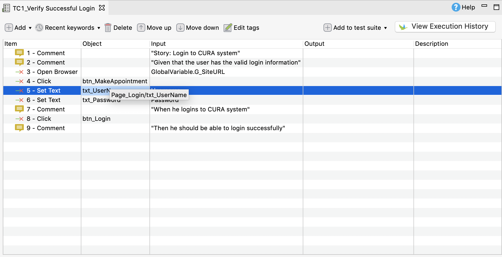

# 参数化Web测试对象
## 参数化Web测试对象及其属性
通过参数化测试对象，您可以通过使用局部或全局变量动态地更新测试对象的定位器。这个特性在以下用例中派上用场:
* 您希望对一组类似的元素执行批量操作，而不需要定义多个测试对象，例如检查多个复选框;

* 您只能在运行时识别一个对象的定位器，因为有一组类似的对象，而所选择的对象不能在测试脚本中预先指定。

Katalon Studio支持参数化测试对象的属性来处理动态对象。动态对象是那些基于特定业务规则在其属性中有一些特定更改的对象。下面的示例描述了如何应用该特性。

打开“医疗保健”示例项目，导航到对象存储库/Page_Login。
1. 选择要参数化其属性的对象。在本例中，选择的测试对象是txt_Username。
2. 捕获它的定位器，并使用${variable_name}语法创建一个变量作为其动态属性的占位符。例如，我们为id属性的值创建了${id}变量。您可以用不同的选择方法参数化测试对象。
* Attributes

* Xpath

* CSS

3. 使用参数化的测试对象。
* 自定义视图
在Manual View中打开您的Test Case，双击您想要参数化其属性的对象。
