# Selenium/TestNG/JUnit 迁移到 Katalon Studio

从 Katalon Studio 7.4.0 版开始，您可以将测试用例从 Selenium、TestNG 或 JUnit 项目迁移到 Katalon Studio。借助支持的功能和关键字，您可以使用 Katalon 执行和维护现有的 Selenium、TestNG 和 Junit 项目，而无需从头开始。

Katalon Studio 支持：

- 硒版本 3.x
- TestNG 6.11 版
- JUnit 4.12 版

> 要求：
>
> - Katalon Studio 版本 7.4.0 及更高版本。

> 您可以下载我们的 Github 示例项目以进行 TestNG 迁移：[TestNG Migration](https://github.com/katalon-studio-samples/TestNG-Migration)。

## 支持的功能和关键字以促进迁移

### Java 类文件

您可以创建、查看和编辑 Java 类文件。

要创建一个新的 Java 类文件，在**Tests Explorer**面板中，转到**Include > scripts > groovy**文件夹，右键单击并选择**New > Java Class**。**选择一个包并在“新建”**对话框中输入类名。

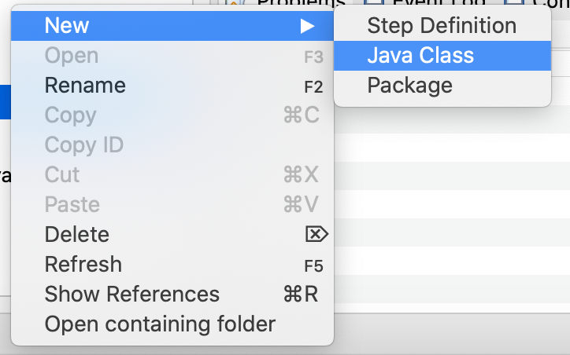

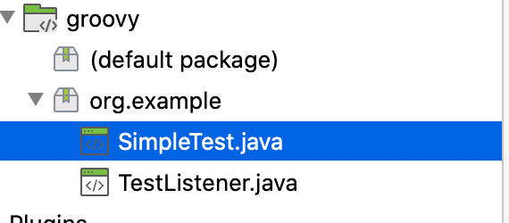

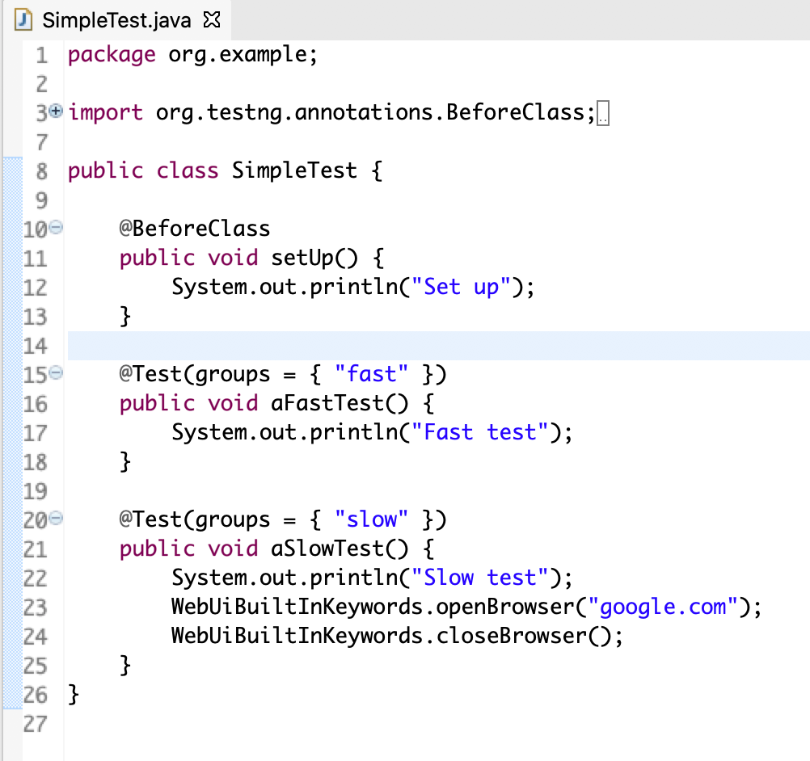

## 内置 TestNG/JUnit 关键字

### 安装 TestNG/JUnit 关键字插件

**您可以使用TestNG/JUnit 关键字**插件在手动视图中启用内置关键字。您可以在此处从 Katalon 商店下载插件：[TestNG/JUnit 关键字](https://store.katalon.com/product/180/TestNG-JUnit-Keywords)。

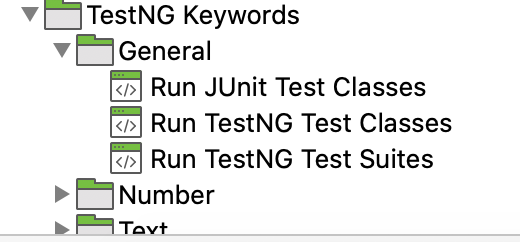

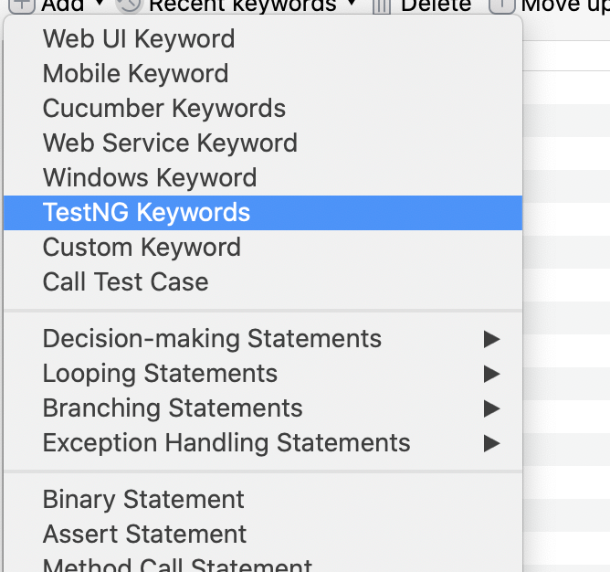

安装插件后，进入 Katalon Studio 并点击**Reload Plugins**。

如果你想离线使用这个插件，可以参考这个文档：[使用私有插件](https://docs.katalon.com/katalon-studio/docs/kse-use-plugins.html#use-private-plugins)。因为**TestNG/JUnit关键词**插件是**平台**插件，所以需要将插件包.jar文件移到文件`<project_name>/Plugins/platform`夹中。

### TestNG/JUnit 关键字

TestNG/JUnit 关键字插件提供 3 个内置关键字来帮助您运行 TestNG/JUnit 测试，如下所示：

▼**runTestNGTestClasses**

**语法**：`runTestNGTestClasses(List testClasses)`

**描述**：运行 TestNG 测试类并在运行报告文件夹中生成 TestNG 报告。

**参数**：

| 参数     | 类型     | 描述                                                         | 强制的 |
| :------- | :------- | :----------------------------------------------------------- | :----- |
| 测试类   | 列表     | TestNG 测试类列表                                            | 必需的 |
| 流量控制 | 故障处理 | 指定故障处理模式以确定是否应允许执行继续或停止。 想了解更多关于故障处理的设置，可以参考这篇文档：[故障处理](https://docs.katalon.com/katalon-studio/docs/failure-handling.html#default-failure-handlingbehavior)。 | 选修的 |

▼**runTestNGTestSuites**

**语法**：`runTestNGTestSuites(List testSuites)`

**描述**：运行 TestNG 测试套件并在运行报告文件夹中生成 TestNG 报告。

**参数**：

| 参数     | 类型     | 描述                                                         | 强制的 |
| :------- | :------- | :----------------------------------------------------------- | :----- |
| 测试套件 | 列表     | .xml 文件形式的 TestNG 测试套件列表                          | 必需的 |
| 流量控制 | 故障处理 | 指定故障处理模式以确定是否应允许执行继续或停止。 想了解更多关于故障处理的设置，可以参考这篇文档：[故障处理](https://docs.katalon.com/katalon-studio/docs/failure-handling.html#default-failure-handlingbehavior)。 | 选修的 |

▼**runJUnitTestClasses**

**语法**：`runJUnitTestClasses(List TestClasses)`

**描述**：运行 JUnit 测试用例并在运行报告文件夹中生成 JUnit 报告。

**参数**：

| 参数     | 类型     | 描述                                                         | 强制的 |
| :------- | :------- | :----------------------------------------------------------- | :----- |
| 测试类   | 列表     | JUnit 测试类列表                                             | 必需的 |
| 流量控制 | 故障处理 | 指定故障处理模式以确定是否应允许执行继续或停止。 想了解更多关于故障处理的设置，可以参考这篇文档：[故障处理](https://docs.katalon.com/katalon-studio/docs/failure-handling.html#default-failure-handlingbehavior)。 | 选修的 |

## 将 Selenium/TestNG/JUnit 项目迁移到 Katalon Studio

> 要求：
>
> 安装 Gradle 版本 5 或更低版本。您可以从 Gradle 网站下载：[Gradle](https://gradle.org/)。

要将 Selenium/TestNG/JUnit 脚本迁移到 Katalon Studio 项目，请执行以下操作：

1. 在 Katalon Studio 中创建一个新项目。转到**文件 > 新建 > 项目**
   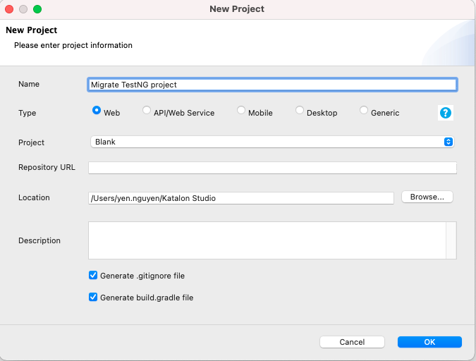

2. 构建项目依赖项。

   2.1 打开 .gradle 文件并添加 Selenium/TestNG/JUnit 项目的 Java 依赖项。

   > 笔记：
   >
   > - 您只需要添加不是 Selenium 依赖项的 JUnit/TestNG 项目依赖项。
   > - Katalon Studio 已捆绑了 TestNG、JUnit 和 Selenium 依赖项，您无需再次声明这些依赖项。

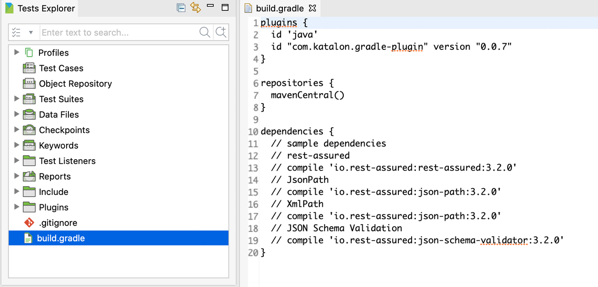

2.2 打开**命令提示符**或**终端**并导航到项目的文件夹。输入`gradle katalonCopyDependencies`，然后等待 Gradle 构建成功。

2.3 重新打开项目重新加载所有依赖。

3. 将Selenium/TestNG/JUnit项目的源代码复制并粘贴到Katalon项目的Include/scripts/groovy文件夹中。

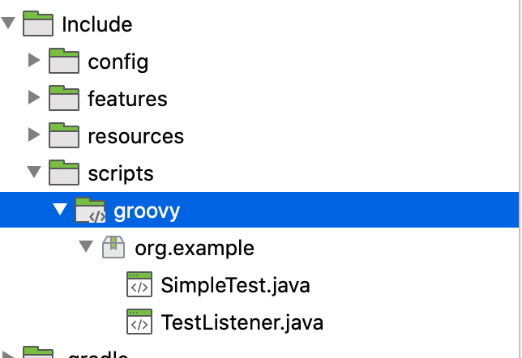

4. 将Selenium/TestNG/JUnit项目的其他资源复制并粘贴到Katalon项目（如果有）的Include文件夹中。

   

5. 要从Selenium/TestNG/JUnit项目中重新加载源代码和资源，请右键单击Include文件夹，然后单击Refresh。

   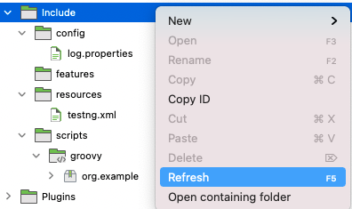

6. 创建一个包含TestNG关键字的测试用例，以运行TestNG测试套件或JUnit测试类。要了解更多关于TestNG关键字的信息，请参阅上文：内置TestNG/JUnit关键字。

   

**笔记：**

为了实时监控和更好的报告能力，请考虑将项目与KATALON TESTORD集成。另请参见从Katalon Studio将测试结果上传到Katalon TestOps。

**另见：**

导入Selenium IDE版本3项目

通过我们的Katalon Academy课程了解更多信息：从Selenium迁移到Katalon Studio——你应该知道的一切

# 导入Selenium IDE版本3项目

除了将Selenium/TestNG/JUnit项目导入Katalon Studio之外，从7.5.10版开始，您还可以导入Selenium IDE项目以使用Katalon Studio执行。

Selenium IDE是一个用于Selenium测试的集成开发环境。它作为Chrome插件和Firefox扩展实现，允许用户记录、编辑和调试测试。Katalon Studio支持Selenium IDE项目版本3。从x开始。

本教程将向您展示如何将Selenium IDE项目导入Katalon Studio中的项目，以及Katalon Studio如何映射导入的测试工件。

要求：

- Katalon Studio version 7.5.10 版及以后

  您可以下载我们的Github示例项目，将Selenium IDE项目导入Katalon Studio：Import Selenium IDE sample。

## 导入 Selenium IDE 项目

In Katalon Studio:

1. 创建或打开一个项目
2. 从菜单栏中，选择文件>导入Selenium IDE项目，并浏览Selenium IDE文件（扩展名为.side的单个文件）以打开。

## 将 Selenium IDE 映射到 Katalon Studio 测试工作

Selenium IDE项目包含测试、套件和执行。Katalon Studio只导入测试和套件。

### Selenium IDE 套件 - Katalon Studio 测试套件

在Tests Explorer的Test Suites文件夹下，Katalon Studio创建了一个Imported from Selenium IDE Scripts文件夹来存储导入的套件。导入过程完成后，Katalon Studio会自动打开测试套件。

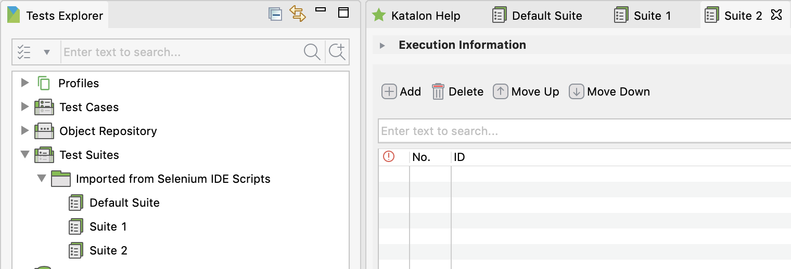

- 笔记：

  如果您的Katalon项目在Test Suites文件夹下已经有一个Imported from Selenium IDE Scripts文件夹，那么新文件夹应该从Selenium IDE Scripts（1）导入。

  如果导入的Selenium IDE项目中没有套件，Katalon Studio不会在Test Suites文件夹下创建从Selenium IDE脚本导入的文件夹。

### Selenium IDE 测试 - Katalon Studio 测试用例

在Tests Explorer的Test Cases文件夹下，Katalon Studio创建一个Imported from Selenium IDE Scripts/<suite name>文件夹来存储导入的测试。

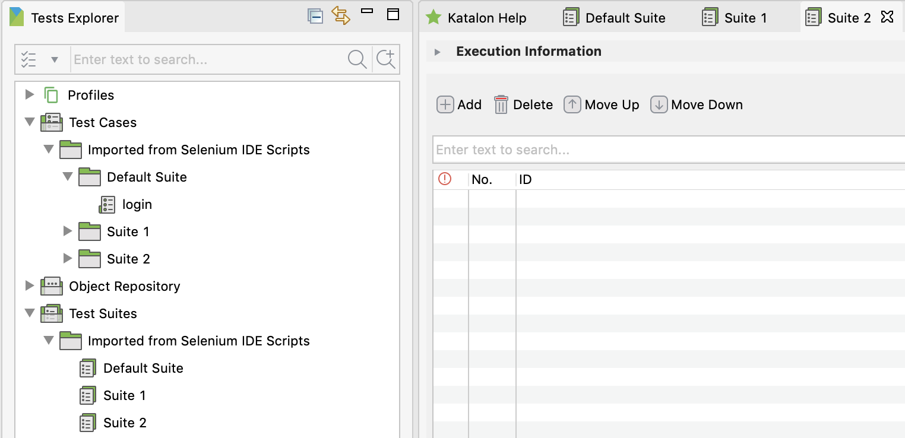

导入的测试用例包含由Selenium IDE记录的一组Selenium命令。

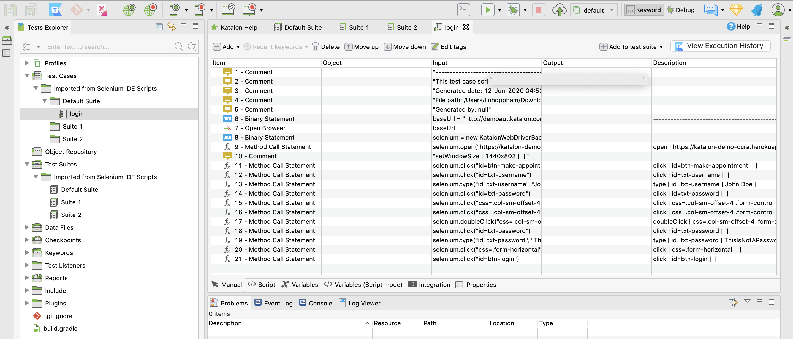

- 笔记：

  支持的元素定位器包括标识符、id、名称、dom、xpath、链接、css和ui。要了解有关Selenium定位器的更多信息，您可以在这里参考Selenium Java文档：Selenium Java文档。

## 另见

- Selenium/TestNG/JUnit迁移到Katalon Studio

  通过我们的Katalon Academy课程了解更多信息：从Selenium迁移到Katalon Studio——你应该知道的一切

