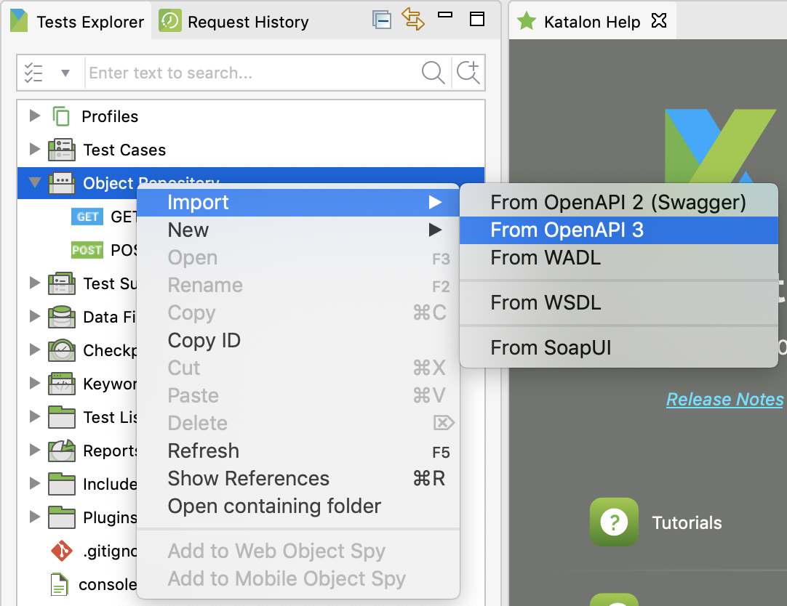
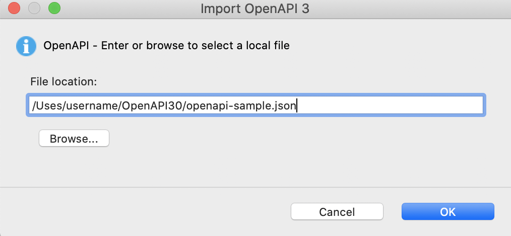
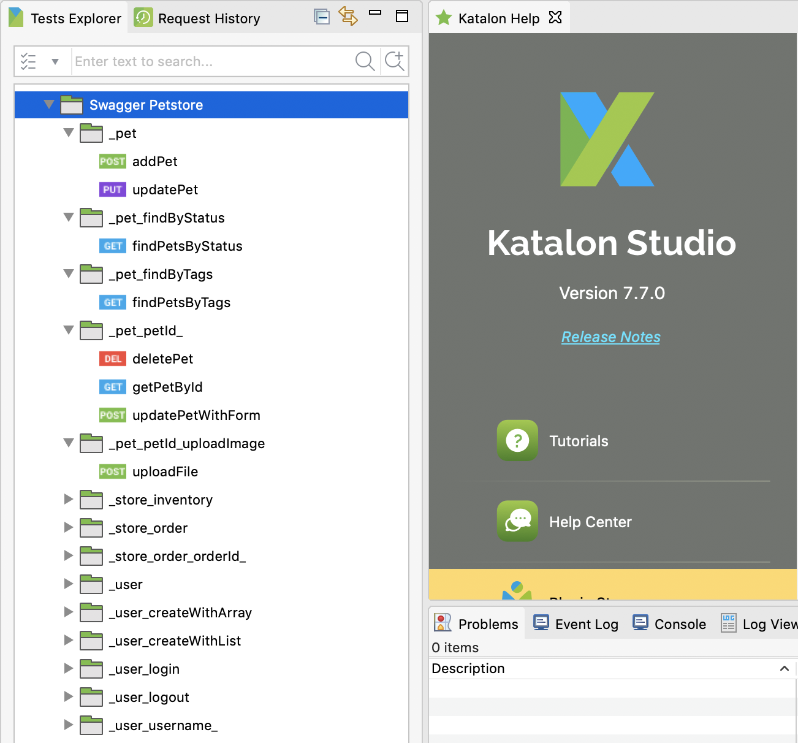
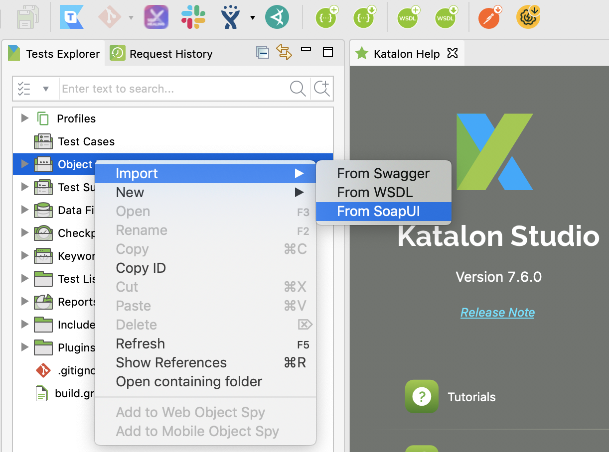
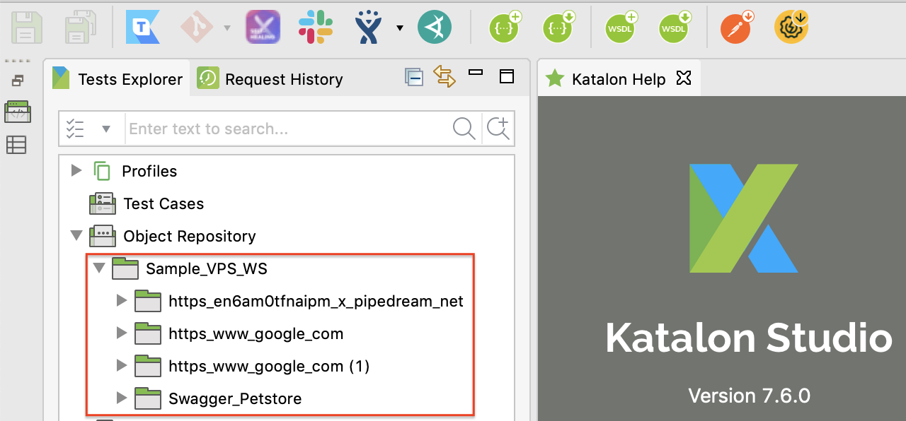
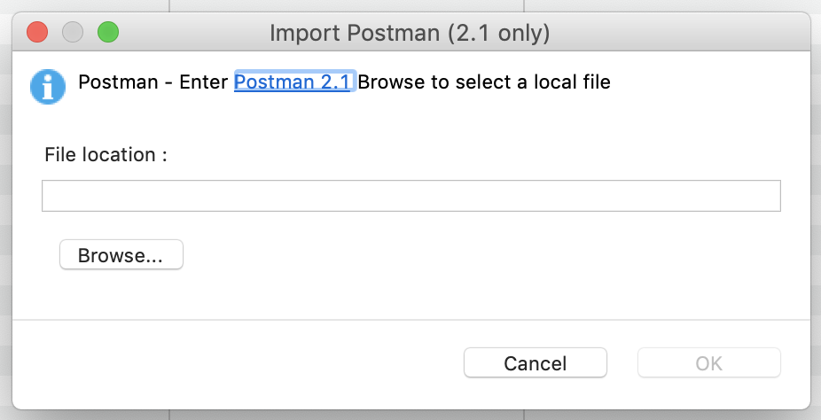
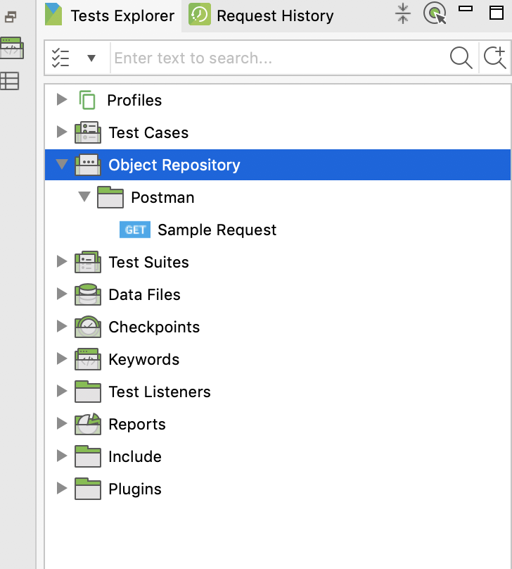

# Web 服务测试对象简介

Katalon Studio 支持使用 RESTful 和 SOAP 服务进行 API 测试。您可以从不同的来源导入它们的定义，创建和测试单个测试请求，或创建功能测试脚本。以下是一些有关使用 Web 服务请求的有用文档：

### REST

[创建和设计一个 RESTful 测试请求](https://docs.katalon.com/katalon-studio/docs/restful.html)。或者您可以从以下位置导入服务定义：

- [OpenAPI 规范 3.0](https://docs.katalon.com/katalon-studio/docs/import-openapi30.html)（要求：7.7 及以上版本和 Katalon Studio Enterprise 许可证）
- [WADL](https://docs.katalon.com/katalon-studio/docs/import-wadl.html)（所需版本：7.7 及以上版本）
- [SoapUI](https://docs.katalon.com/katalon-studio/docs/import-soapui.html)（需要的版本：7.6 及以上）
- [OpenAPI 规范 2.0 (Swagger)](https://docs.katalon.com/katalon-studio/docs/import-rest-requests-from-swagger-20.html)
- [Postman](https://docs.katalon.com/katalon-studio/docs/import-postman.html)

### SOAP

[创建和设计一个 SOAP 测试请求](https://docs.katalon.com/katalon-studio/docs/soap.html)。[或者，您可以从WSDL](https://docs.katalon.com/katalon-studio/docs/import-soap-requests-from-wsdl.html)导入服务定义。

### 功能

- [构建器以脚本模式轻松创建和管理 Web 服务对象](https://docs.katalon.com/display/KD/Web+Services+Builder)。
- [参数化 Web 服务对象](https://docs.katalon.com/katalon-studio/docs/parameterize-a-web-service-object.html)。

> 通过 Katalon Academy 课程了解有关 REST、SOAP 和其他 API 高级请求的更多信息：[使用 Katalon Studio 进行 API 测试 - 基础知识](https://academy.katalon.com/courses/katalon-api-testing/?utm_source=kat_docs&utm_medium=web_services_test_objects)。

# 使用 OpenAPI 规范 3.0 导入 REST API

本手册向您展示了如何将具有[OpenAPI 规范版本 3.0](https://swagger.io/specification/)的 RESTful API 导入Katalon Studio。对于 OpenAPI 2.0 (Swagger)，请参阅以下[文档](https://docs.katalon.com/katalon-studio/docs/import-rest-requests-from-swagger-20.html)。

**要求**

- Katalon Studio 版本 7.7+。
- 有效的 Katalon Studio Enterprise 许可证。

要使用 OpenAPI 3.0 导入服务定义，请执行以下操作：

1. 打开或创建项目 > 导入服务定义有两种方式：

   - 对于 API 或 Web 服务项目类型，单击 OpenAPI 图标 > 选择**Import OpenAPI 3**。
     
   - 或者在**Tests Explorer**中，右键单击**Object Repository** > 选择**Import > From OpenAPI 3**。

   

2. 在显示的对话框中，浏览您的**OpenAPI 3.0**本地文件 > 单击**OK**。

​	Katalon Studio 加载文件并相应地生成 RESTful 测试请求。

# 从 SoapUI 导入 Web 服务请求

在 7.8 及更高版本中，您可以将 SOAP 请求从[SoapUI](https://www.soapui.org/getting-started/)导入到 Katalon Studio。之前在 7.6 版本中引入，您已经可以从 SoapUI 导入 RESTful 请求。

要将 REST/SOAP 测试请求从 SoapUI 导入到 Katalon Studio，请执行以下操作：

1. 然后打开或创建一个项目

- 单击“**从 SoapUI 导入服务**”图标（仅适用于 API/Web 服务项目类型）；或者
  
- 在**Tests Explorer**中，右键单击**Object Repository**的任何文件夹并选择**Import** > **From SoapUI**。
  

3. 在显示的对话框中，浏览到您的**SoapUI**项目并单击**OK**。

Katalon Studio 加载文件并相应地生成 RESTful/SOAP 请求对象。

# 从Postman导入

要从 Postman 导入测试请求，请执行以下操作：

1. 将 Postman 集合导出为 JSON。[请参阅此处](https://learning.getpostman.com/docs/postman/collections/data_formats/#exporting-and-importing-postman-data)的说明。
2. 在 Katalon Studio 中，使用 API/Web 服务项目，单击 Postman 图标
   
3. 在显示的对话框中，浏览您导出的 Postman 本地文件并单击**OK**。

相应的测试请求将被导入到 Katalon Studio。

