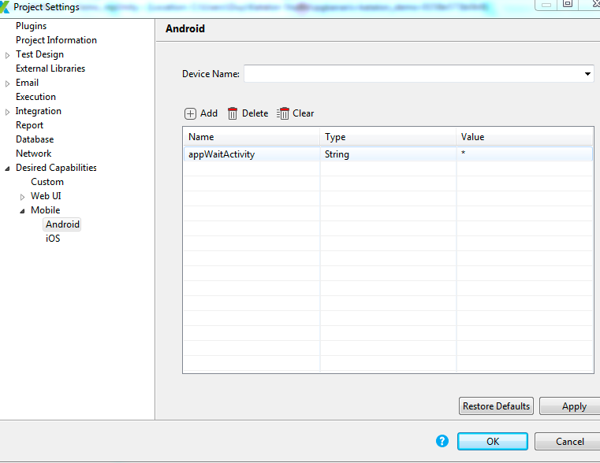
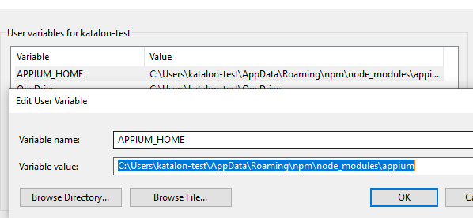

# 自动化移动测试故障排除

   > - 请先阅读**[安装和设置](https://docs.katalon.com/display/KD/Before+You+Start)**指南以设置您的手机。以下信息是为那些在完成设置指南后无法正常进行移动测试的人提供的。

| 序号 | 问题列表                                                     |
| ------ | :-------------------------------------------------------- |
| 1    | 连接的设备未显示在“设备名称”列表中。                         |
| 2    | xcodebuild 以代码“65”和信号“null”退出。                      |
| 3    | Xcode 无法为`WebDriverAgentRunner` 目标创建配置文件。        |
| 4    | 30 秒内启动 Appium 服务器失败。                              |
| 5    | 60 秒内启动 Appium 服务器失败。原始错误：“x.x.SplashActivity”从未启动。 |
| 6    | 没有找到Carthage。                                     |
| 7    | 无法在此设备上启动应用程序：Appium 目录无效。                |
| 8    | 在 Windows 机器上运行 Android 测试时无法启动应用程序。       |
| 9    | com.kms.katalon.core.appium.exception.AppiumStartException：未设置 Appium 目录。 |
| 10   | java.util.concurrent.ExecutionException：org.openqa.selenium.WebDriverException：处理命令时发生未知的服务器端错误。原始错误：无法将命令代理到远程服务器。原始错误：超过 240000 毫秒的超时。 |
| 11   | 卡塔隆移动端记录器和 SetText 关键字无法在基于 Flutter 的应用程序的**EditText**元素上执行 |

## Q：连接的设备未显示在“设备名称”列表中。
A：**iOS**

- 将您的设备连接到 Xcode。

- 转到设置 -> 开发人员 > 打开 UIAutomation。

- 使用终端上的以下命令检查您的设备是否被识别。

  ```groovy
  cd /Applications/Katalon\ Studio.app/Contents/Eclipse/configuration/resources/tools/imobiledevice  idevice_id -l
  ```

  如果您的 iOS 版本是 iOS 11，请确保 Katalon Studio 的版本是 5.3+。

**安卓**

- 开发人员选项已打开。
- 每当您的设备上显示此对话框时，点击“信任此计算机”即可建立受信任的连接。
- 使用 adb 命令检查设备是否列出：
  - 在 Windows 命令行/MacOS 终端上：导航到 <Android SDK 文件夹>\platform-tools 中的 platform-tools 文件夹。
  - 输入“adb devices”并观察那里列出的设备。确保您更正的设备在此处列出并且是在线状态。 

## Q：xcodebuild以代码“65”和信号“null”退出。
A：您的 .ipa 应用程序和/或 WebDriverAgent 未正确签名。

解决方案：

- 使用您的开发人员证书签署并重建 WebDriverAgent XCode 项目。
- 从 WebDriverAgentRunner 中取消选中“自动签名”选项，然后选择**有效的配置文件**（从列表中显示为合格的配置文件）。

## Q：Xcode无法为`WebDriverAgentRunner`目标创建配置文件。
A：这需要通过进入“构建设置”选项卡手动更改目标的捆绑 ID，并将“产品捆绑标识符”从 `com.facebook.WebDriverAgentRunner` 更改为 Xcode 将接受的内容。
## Q：30秒内启动Appium服务器失败。
A：Katalon Studio 无法在 30 秒内启动 Appium 服务器（默认超时）。您可以从此设置中增加此超时值：项目→设置→执行→默认→默认等待元素超时（以秒为单位）。
## Q：60秒内启动Appium服务器失败。原始错误：“x.x.SplashActivity”从未启动。
A：将您的 Appium 日志级别设置为“调试”，您可以在 Windows > Katalon Studio Preferences > Katalon > Mobile 中找到此选项以生成 Appium 的调试日志。

应用此更改后，重试您的记录/间谍会话，然后在项目文件夹中打开生成的 .appium 文件。 
在此文件中的某处，您可能会看到以下几行： 

```groovy
[debug] [ADB] Running '..\adb.exe' with args: [...] [debug] [ADB] Found package: 'com.abc.def.xyz' and fully qualified activity name : 'com.egh.jik' [debug] [ADB] Incorrect package and activity. Retrying.
```

 

根本原因在于，默认情况下Katalon Studio 会使用不正确的包和活动，导致无法启动应用程序，因此您需要为所需的功能添加额外的设置： 

 \- 导航到移动设置（项目 > 设置 > 执行 > 默认 > 移动 > Android）。 
 \- 添加以下键。
  Name：appWaitActivity。 
  Value：com.*（**基于 'Found package' log 的前缀**）

## Q：没有找到Carthage。
A：Appium 1.7 与 Xcode 9 的已知问题： [https](https://github.com/appium/appium/issues/9344) ://github.com/appium/appium/issues/9344 ，因此请使用 Katalon Studio 5.1.0.2+ 以避免此消息。
## Q：无法在此设备上启动应用程序：Appium目录无效。
A：Katalon Studio 找不到提供的 Appium 目录。请仔细检查您的 Appium 目录以确保它应如下所示：

Windows：（窗口 → Katalon Studio 首选项 → 移动 → Appium 目录）。

```groovy
C:\Users\<Username>\AppData\Roaming\npm\node_modules\appium
```

MacOS/Linux：（Katalon Studio → 首选项 → 移动 → Appium 目录）。

```groovy
/usr/local/lib/node_modules/appium
```

## Q：在Windows机器上运行Android测试时无法启动应用程序。
A：首先，升级到最新版本的 Appium。

在 Katalon Studio 中，转到**Project Settings > Desired Capabilities > Mobile > Android**并添加以下所需功能：

- Name: `appWaitActivity`
- Type: String
- Value: *



单击**应用**保存，然后再次运行测试。

## Q：com.kms.katalon.core.appium.exception.AppiumStartException：未设置Appium目录。
A：使用**Katalon Runtime Engine**运行测试时，默认情况下 Katalon 检查 Appium 目录：
- APPIUM_HOME 环境变量 (*)。
- Windows：C:\Users\AppData\Roaming\npm\node_modules\appium
- macOS 和 Linux：/usr/local/lib/node_modules/appium

(*) 使用 APPIUM_HOME 环境变量设置 Appium 位置：

视窗：

macOS 和 Linux：

```groovy
export APPIUM_HOME=/usr/local/lib/node_modules/appium
```

## Q：java.util.concurrent.ExecutionException：org.openqa.selenium.WebDriverException：处理命令时发生未知的服务器端错误。原始错误：无法将命令代理到远程服务器。原始错误：超过240000毫秒的超时。
A：解决方案：

1. 安装[Webdriveragent](https://docs.katalon.com/katalon-studio/docs/installing-webdriveragent-for-ios-devices.html)。

2. 使用以下命令终止正在运行的 appium 进程：

   ```
   killall -9 node
   ```

3. 再次启动 AUT。

## Q：卡塔隆移动端记录器和SetText关键字无法在基于Flutter的应用程序的**EditText**元素上执行

A：解决方案：

1. 创建一个[SetText 自定义关键字](https://docs.katalon.com/katalon-studio/docs/flutter-based-application-testing.html)。
2. 以脚本模式再次运行测试。
