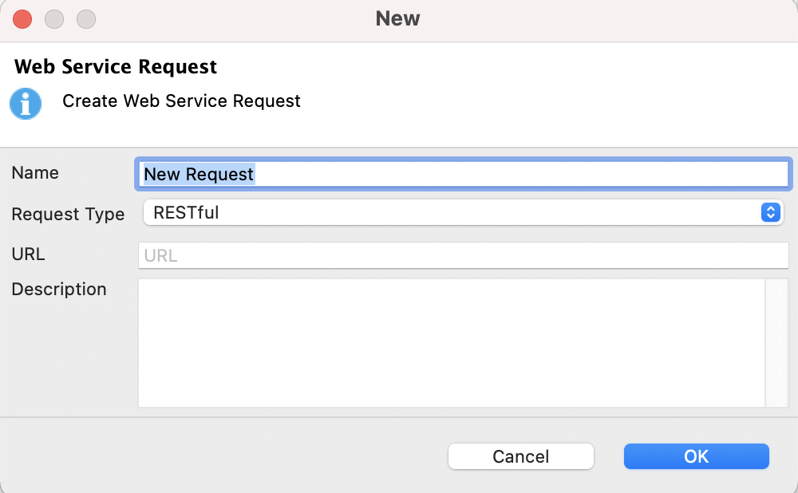
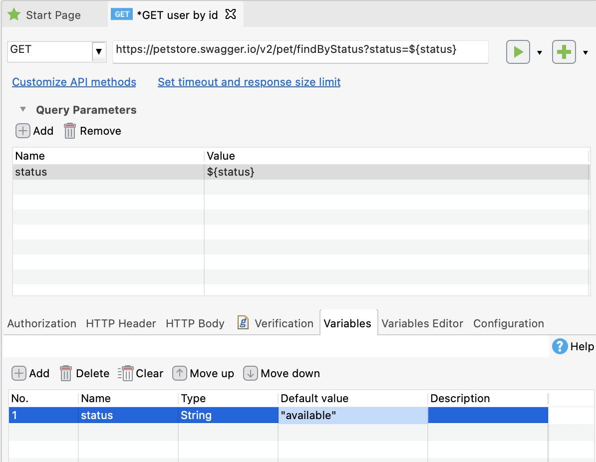
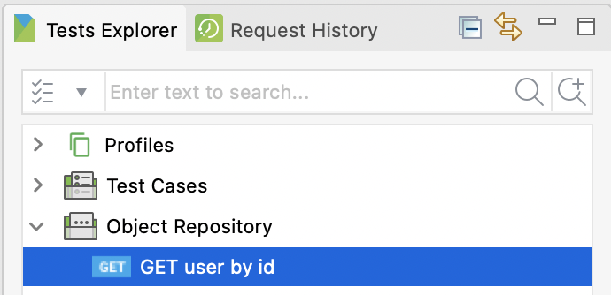
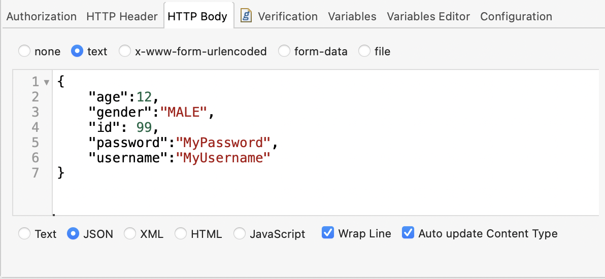
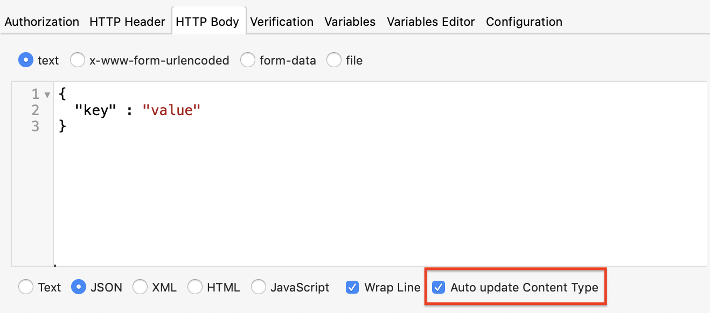
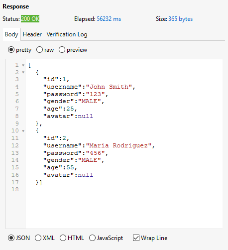
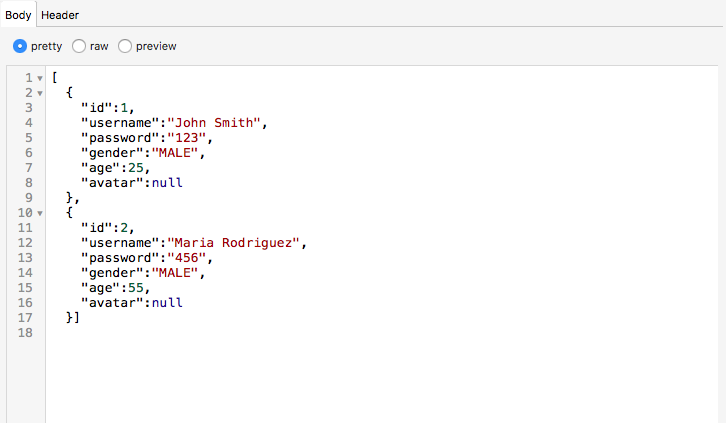
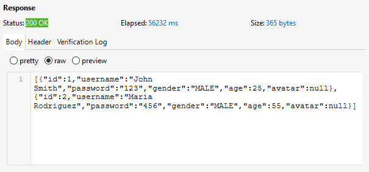
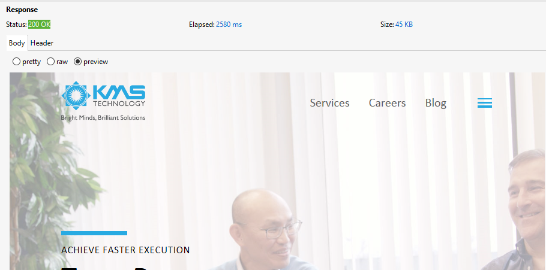
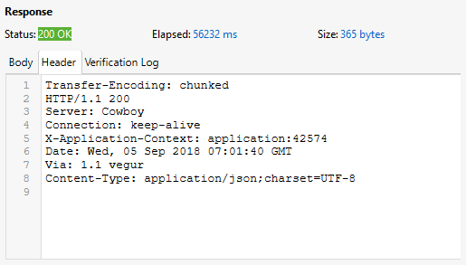

# 休息请求

Katalon Studio 支持发送带有所需参数、正文数据和授权详细信息的 RESTful 请求。发送请求时，您可以收到来自 API 服务器的响应以进行检查和故障排除。本节为您提供有关如何创建和配置 RESTful 请求的详细信息。

## 创建 RESTful 请求

您可以通过两种方式创建新的 RESTful 请求对象。首先，您可以通过单击**加号**图标直接在对象详细信息视图中将 Web 服务请求**添加**到*新建*或任何*现有*测试用例。

或者 从主菜单中选择**文件 > 新建 > Web 服务请求。**

在 **New Web Service Request** 对话框中，为您的请求指定一个名称；在请求类型的下拉列表中选择**RESTful ；**并设置请求 URL。然后单击确定以创建请求。

## 指定请求详细信息

成功创建请求后，双击请求以打开其编辑器以添加详细信息。

### 请求方法

request 方法指示要在指定资源上执行的预期操作。对于 REST 服务，Katalon Studio 支持以下方法：GET、POST、PUT、DELETE、PATCH、HEAD、CONNECT、OPTIONS 和 TRACE。您可以参考[此文档](https://restfulapi.net/http-methods/)了解更多详细信息以及每种方法的规格。

对于 Katalon Studio Enterprise 用户，您可以使用**Project > Settings > Test Design > Web Service > Custom Method**中添加的自定义方法。

在测试资源管理器中， 对象旁边有一个小**图标，指示其使用的方法。**默认情况下，为新请求选择 GET 方法。

### 请求网址

您需要指定一个 URL，指示每个请求的服务端点。例如，`https://petstore.swagger.io/v2/pet/findByStatus?status=${status}`为我们创建的 RESTful 请求注册了以下 URL。在 URL 中，您可以使用变量，`status=${status}`例如，动态更新查询参数。[更多细节](https://docs.katalon.com/katalon-studio/docs/parameterize-a-web-service-object.html)。

### 参数

此表显示要与 RESTful 请求对象一起传递的任何参数。这些值是根据请求 URL 自动生成的，也可以手动添加。[更多细节](https://docs.katalon.com/katalon-studio/docs/parameterize-a-web-service-object.html)。

从**7.0 版本**开始，Katalon Studio 在发送请求之前对查询参数中的特殊字符进行编码。

### 请求正文

您可以添加需要与 RESTful 请求对象一起发送的正文信息。Katalon Studio 支持以下正文数据类型：文本、x-www-form-urlencoded、表单数据和文件。

- **Text**：对于这种类型，支持的格式包括 Text、JSON、XML、HTML 和 Javascript。
  

- **Form-data**：此数据类型允许您将数据作为 multipart/form-data 发送到 API，也可以附加文件。从**7.5.0+ 版本开始**，您可以在表单数据正文中指定内容类型。

  

### 请求认证

这部分用于对请求进行认证和授权，即验证客户端是否被允许发送请求，并执行端点操作。

有关使用每种身份验证的更多详细信息，请参阅：

- [基本的](https://docs.katalon.com/katalon-studio/docs/authorization-basic.html)
- [OAuth 1.0](https://docs.katalon.com/katalon-studio/docs/authorization-oauth1.html)
- [OAuth 2.0](https://docs.katalon.com/katalon-studio/docs/authorization-oauth2.html)

### 请求标头

您可以配置发送 RESTful 请求对象所需的标头信息。默认情况下，**Header的****Content-Type**值是根据 HTTP Body 自动生成的。您还可以从建议选项列表中选择标题（通过双击**名称**单元格）或输入您感兴趣的另一个标题。有关详细信息，请参阅[支持的 HTTP 标头](https://developer.mozilla.org/en-US/docs/Web/HTTP/Headers)。

从**7.2.5**版本开始，Katalon Studio 支持禁用自动指定基于 HTTP Body 的 HTTP Header 的内容类型。这允许用户分别为 HTTP Header 和 Body 配置内容类型。

## 回复

发送请求后，Katalon Studio 支持在单独的**响应**视图中读取其响应。服务响应包括状态、经过时间和大小字段；正文部分、标题和验证日志。

- **Status** : 响应的状态码

- **Elapsed**：从请求开始发送到 Katalon Studio 收到响应的最后一个字节的总时间

- **Size**：响应包的大小。

  

### 响应体

Katalon 可以读取 JSON、XML、HTML 和 JavaScript 格式的服务响应。响应正文可以以三种格式显示：漂亮、原始和预览。

- **pretty**：响应以更容易阅读的漂亮格式显示
  

- **raw** : 响应以原始文本显示，没有任何格式
  

- **preview** : 响应显示为可视化（例如，如果响应来自加载特定网页，则显示如下截图）

  

### 响应头

响应的标头显示在 **标头** 选项卡中：

