# 记录网络实用程序

测试记录是测试人员创建自动化测试脚本的最简单方法。这意味着您只需要手动与您的网站交互，并在 Katalon 记录器实用程序记录它们时以真实用户的身份执行所有所需的操作。

> 从**7.7+ 版本开始**，Katalon Studio 支持在使用 Chrome、Edge（基于 Chromium）和 Firefox 进行录制时通过右键单击 AUT 中的元素来添加鼠标悬停和验证步骤。

您可以使用 Katalon Recorder Utility 创建新的测试脚本或编辑现有的测试脚本。本手册包括如何录制测试脚本的教程以及 Katalon Web Recorder 各个面板的简要介绍。

## 记录一个新的测试用例

要记录新的测试用例，请执行以下操作：

1. 单击**Web Record Utility**图标以打开 Web Recorder。

2. 输入您的 Web 应用程序的 URL。例如，https://katalon-demo-cura.herokuapp.com/

3. **选择一个浏览器开始录制（推荐使用“新浏览器**”类型的Chrome 或 Firefox ）。您可以看到记录了名为“打开浏览器”的第一个测试步骤。

   Katalon Studio 的默认浏览器是 Chrome，其图标显示在右上角。如果您更喜欢其他支持的浏览器，您可以在**Project/Settings/Execution/Default execution**中更改默认浏览器，或单击下拉按钮选择您喜欢的浏览器：

   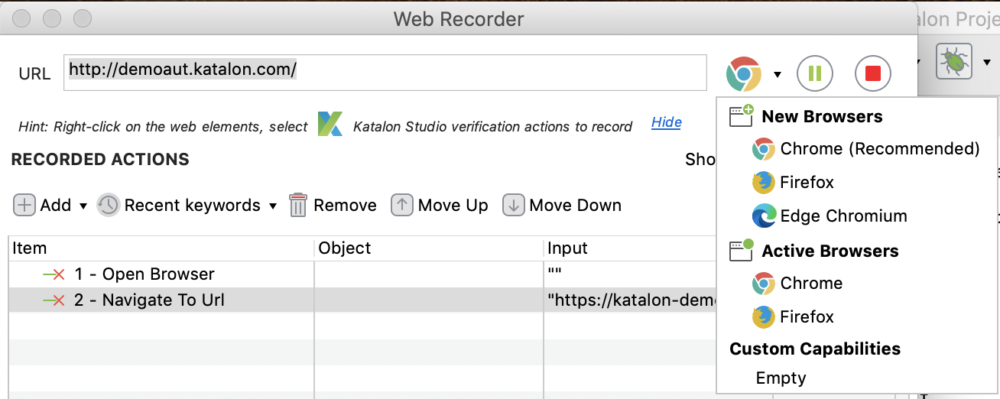

   | 类型       | 描述                          | 笔记                                                         |
   | :--------- | :---------------------------- | :----------------------------------------------------------- |
   | 新浏览器   | 启动新浏览器                  | **支持的浏览器：**  - Firefox  - Chrome  - Internet Explorer（仅在 Windows 上）  - Microsoft Edge (Chromium)（从 7.5.10 版本开始） |
   | 活动浏览器 | 使用当前浏览器（仅限 Chrome） | Katalon Studio 将安装[Katalon Recorder](https://chrome.google.com/webstore/detail/katalon-recorder-selenium/ljdobmomdgdljniojadhoplhkpialdid)作为插件，以帮助录制此类浏览器  **支持的浏览器：**  - Chrome  - Firefox |

4. 浏览器实例会自动启动。等待您的网页加载并与其元素交互。

5. 当您悬停该元素时，浏览器会突出显示并显示其对应的 XPath（在页面顶部）。

> 提示：您可以使用热键捕捉对象（按 的组合`<Alt + back quote>`）。捕获的对象将以绿色边框突出显示。

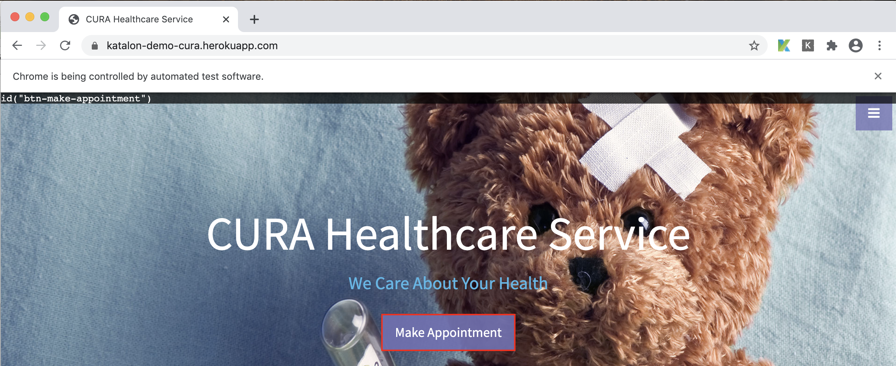

6. 与网页交互。在此示例中，尝试使用提供的凭据登录。记录的步骤将在**Recorded Actions**中自动生成。当您输入**密码**字段时，Katalon Web Recorder 会自动使用“[设置加密文本](https://docs.katalon.com/display/KD/[WebUI]+Set+Encrypted+Text)”关键字。输入的值将被加密以确保安全。

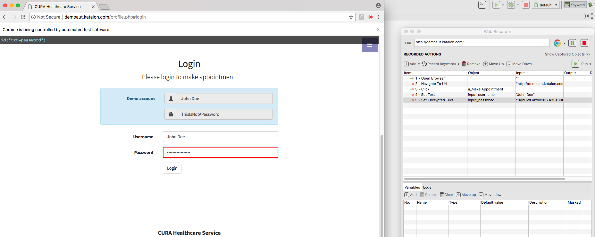

7. 停止录制并保存您的脚本。

在您的录制过程中，Katalon 会捕捉您与之交互的对象。保存测试脚本时，**Katalon Web Recorder 会**导出测试用例中使用的对象列表。选择您希望测试对象驻留的目录以继续。

## 使用现有测试用例记录

使用新的 Web Recorder，用户可以在修改现有测试用例时提高工作效率。无需在 UI 发生更改时创建全新的测试用例，而是将忽略新更改可能如何影响现有功能的风险降至最低。

1. 打开任何现有的测试用例以继续记录。

2. 单击“**记录”**图标以打开 Web 记录器。

   所有现有的测试步骤和[测试用例变量](https://docs.katalon.com/display/KD/Variable+Types#VariableTypes-Localvariables)将分别导入到Web Recorder 中的**Recorded Actions**和**Variables选项卡。**您无需重复已记录的测试步骤。

   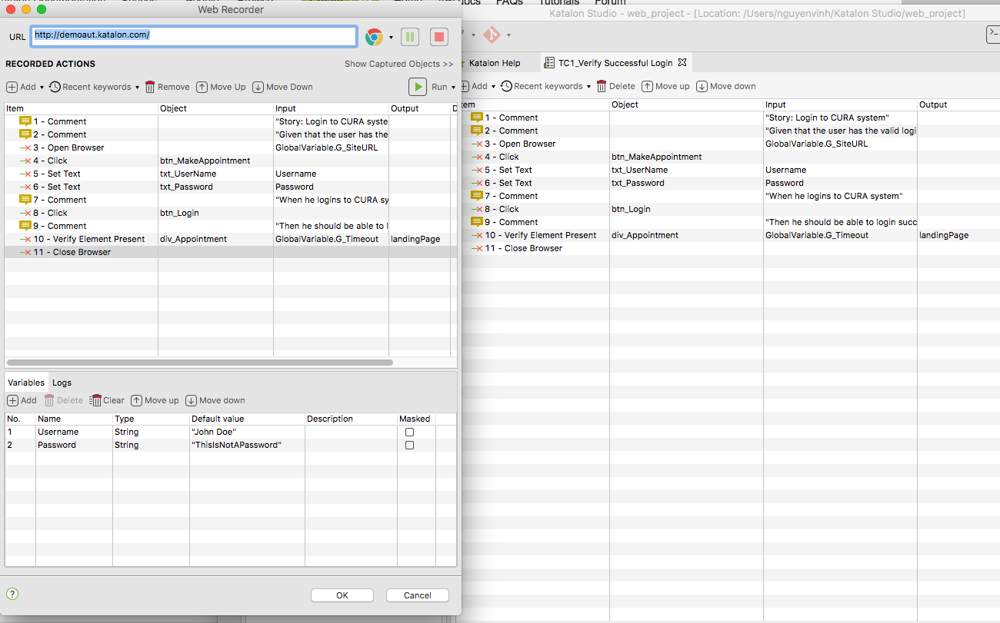

3. 与 AUT 交互。

保存脚本时，Katalon Studio 会自动检测**Objects Repository**中类似的现有对象，并要求您采取进一步措施来优化 Object Repository。

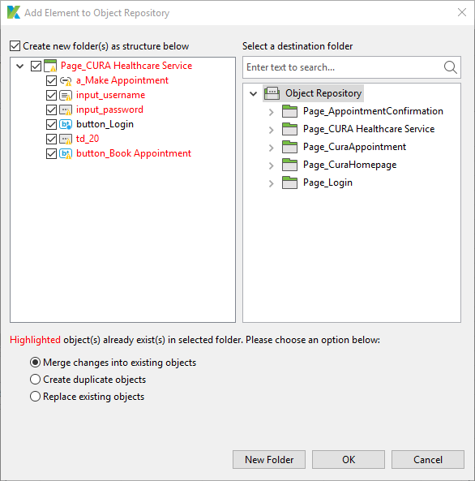

## 验证 UI 元素

> 从**版本 7.7+ 开始**，Katalon 支持在使用 Chrome、Edge（基于 Chromium）和 Firefox 进行录制时，通过右键单击 AUT 中显示的元素来添加鼠标悬停和验证步骤。

如果您输入了不正确的用户名或密码，您可以验证网站是否显示指示登录尝试失败的错误消息。

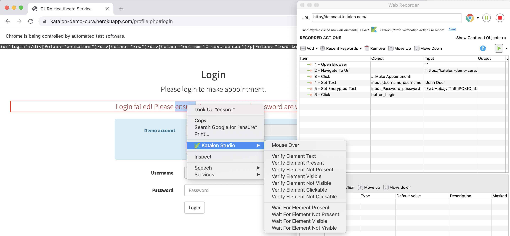

或者，您可以通过验证特定 UI 元素是否存在来验证成功登录后的下一个屏幕是否“正确”。

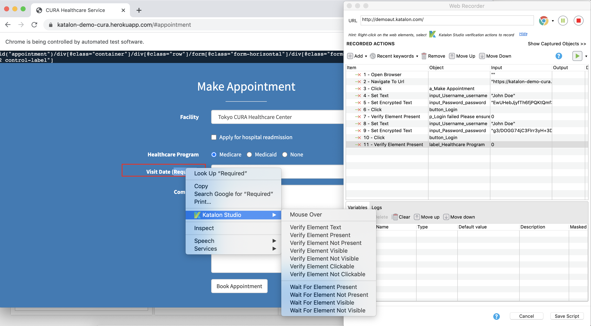

**在运行**按钮的下拉列表中，您可以找到一些运行选项。标有“调试”的两个是高级选项，用于验证录制的脚本，如果您拥有 Katalon Studio Enterprise 许可证，您可以避免一遍又一遍地运行所有测试步骤：

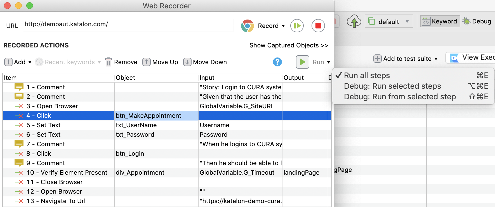

- **运行所有步骤**：执行在 Web Recorder 上启用的所有步骤

- **调试：运行选定的步骤**：只执行一个或多个选定的步骤。

  您可以使用 Ctrl 或 Shift 键选择多个步骤。选定的步骤将突出显示（例如，步骤#2、#6、#9 和#11 被选中运行）。

  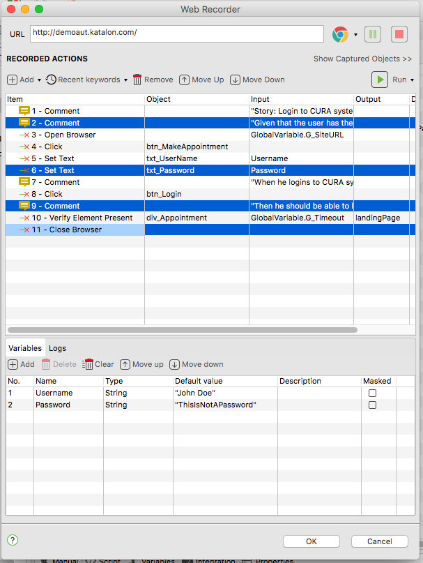

**调试：从选定的步骤运行**：执行当前选定的步骤和选定步骤之后的所有步骤（例如从步骤#4 运行测试。

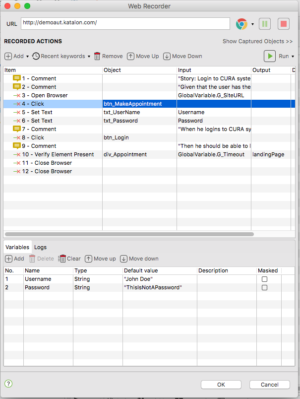

## Katalon Web Recorder 实用程序的组件

### 记录的动作

Katalon Web Recorder Utility 中可用的操作与 Katalon Studio 的[内置关键字](https://docs.katalon.com/display/KD/Built-in+Keywords)相同。您可以添加任何操作、调用另一个测试用例和/或使用自定义关键字。

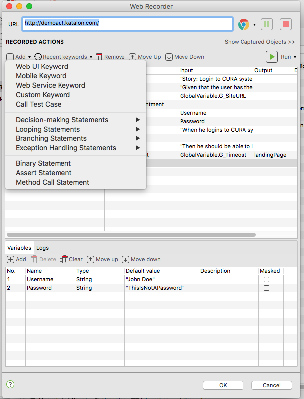

### 捕获的对象

在您的录制过程中，Katalon 会捕捉您与之交互的对象。保存测试脚本时，**Katalon Web Recorder 会**导出测试用例中使用的对象列表。[了解有关 Web UI 测试对象](https://docs.katalon.com/x/tQTR)的更多信息。

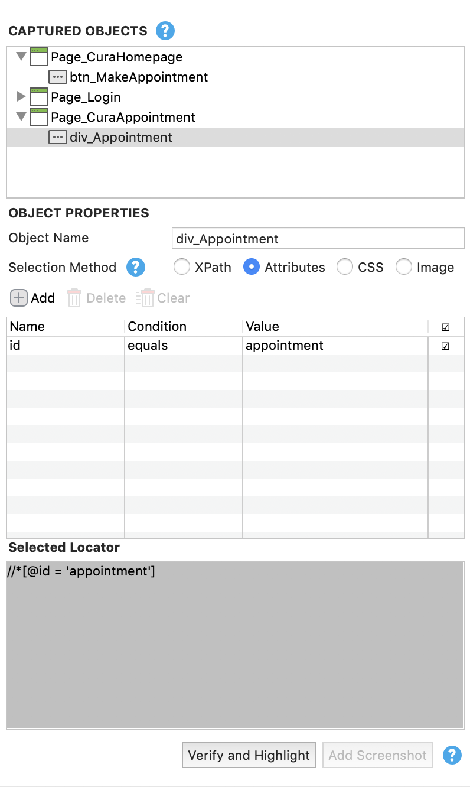

### 变量

在 Katalon Web Recorder 中，您可以管理与您的录音直接相关的[变量。](https://docs.katalon.com/x/RoIw)

### 日志

在运行记录的操作时，您可以通过查看其实时详细日志来调查执行情况。执行日志显示在“**日志**”选项卡上。

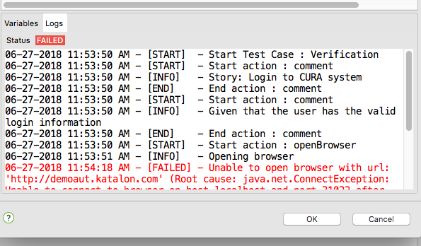

对于分支、循环或验证等高级功能，您可以参考以下文章： 

- [通用验证](https://www.katalon.com/tutorials/common-validation/) 
- [控制语句](https://docs.katalon.com/display/KD/Control+Statements)

