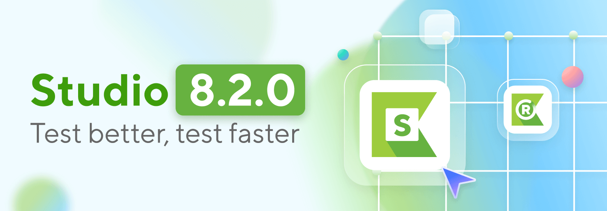
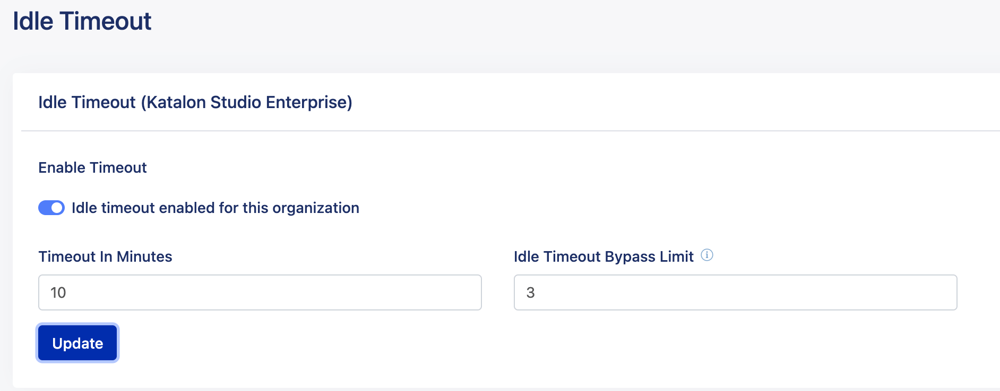

# Katalon Studio 8.2 发布
Katalon Studio最新的v8.2.0版本已经发布，在这个版本中，我们更加关注速度和性能，
V8.0.2版本耗费更少的资源，为软件交付提供更强的能力。

# 新功能
Studio 8.2改善了性能，解决了自动化测试周期长、资源占用率高的情况；同时也对启动、打开项目、测试用例、关键字文件等方面的加载性能进行了提升。

此外，随着Katalon Studio解决高风险的安全漏洞，开源软件的兼容性增强也在不断实现，进一步增强了Katalon Studio和被测系统(SUT)之间的同步。

还有其他一些功能包括空闲超时绕过限制，对Chrome和Edge Chromium版本95的支持。

[下载 Katalon Studio](https://www.katalon.com/download/)

## 增强的Studio IDE和运行时引擎(KRE)性能
作为我们开发过程中的一个重点，性能不断增强，并且在v8.2.0中得到了提升，关键字只有一个，简单而强大: **速度**。

* 在KRE打开大型项目的速度现在快了两倍，中小型项目快了1.5倍
* 重命名测试用例现在快了2倍
* 打开测试用例现在快了两倍
* 移动测试用例现在快了1.5倍

我们通过删除和加载不重要的内容、重构代码，以及添加新特性(例如实例和关键字之间的延迟)来禁用HAR文件生成，将CPU和内存消耗降至最低。总之，这些功能增加了
响应性，这意味着更少的等待和更多的行动。

下面是关于最新版本中主要增强功能的一些细节。
## 在并行模式下运行的测试套件集合的实例之间的延迟
具有[并行执行](https://www.katalon.com/resources-center/blog/parallel-vs-traditional-testing-devops/ "并行执行")的测试集收集(TSC)有助于
节省运行时间，但也会在启动时消耗大量内存和CPU;想象一下>一次执行20次/浏览器。

为了解决这个问题，我们引入了一个名为Delay between instances的新设置，因此在为设备创建响应缓冲区之间，执行将有一个延迟。这是一个微小的改变，但却足
够强大，能够阻止资源使用峰值，从而创造出“像黄油一样顺畅”的体验。

您可以自由选择Katalon Studio的UI选项或在Katalon Runtime Engine中的-delayBetweenInstances参数来应用该特性。
## 新的关键字禁用HAR文件生成
HAR文件是一种用于记录浏览器和网站之间交互信息的格式。虽然在故障排除性能问题方面很有帮助，但默认情况下为每个web服务请求生成HAR文件会导致过大的工作负载，
特别是对于成千上万的请求。

因此，添加关键字允许您根据需要启用或禁用HAR文件生成，这将显著提高大型测试套件的执行速度。了解更多[WS]设置HAR文件生成和[WS]获取HAR文件生成。
# 软件合规改进
## 开源缺陷报告
为了提高测试环境的安全性和可访问性，Katalon Studio团队正在进行[White Source Bolt Build report](https://github.com/katalon-studio/katalon-studio/releases/download/v8.2.0/KatalonStudio-openSourceReport.html "White Source Bolt Build report")的工作:
* 移除MySQL库以添加禁用外部域连接的选项。
* 升级xmlBeans和Apache Commons Compress的版本范围。
## 禁用外部连接的选项
当与Katalon Studio工作时，你将需要连接到某些外部域，如update.katalon.com，后端.katalon.com的多种目的:获得更新，内容和通知。然而，在某些需要
高安全性的组织(如医疗保健和银行)中，外部连接将受到限制。

您可以禁用或有几个域的替代方案，而有些仍然保持原样。在这个版本中，我们添加了禁用其余域的选项。这将出现在UI上便于访问，并添加了一个工具提示来通知相应的域，
帮助用户识别连接。
## 处理Selenium的时间问题-Studio的补救措施
如果元素还没有加载完，就急于与它们交互，这是Selenium用户经常面临的麻烦。没有等待机制的测试工具可能会过早采取行动，从而产生假阴性的测试结果。
### 当一个元素在加载叠加后，自动延迟点击关键字
加载覆盖通常用于提供优惠，折扣，或电子邮件订阅框的网站上所有的访问者，但这也阻止了与网站上的元素的交互，直到他们完成加载。因此，一个好的测试工具应该知道
是否有覆盖，并等待采取行动。

在这个版本中，我们改进了测试引擎(KS和KRE)来检测失败是否由覆盖目标元素的加载覆盖引起，如果是这样，测试引擎将等待一段时间(在项目设置中预定义)，然后再次
执行点击操作关键字。
### 增强的智能等待，等待获取API请求
以前在Chrome和Firefox上可用，智能等待也被添加到支持Edge Chromium。

智能等待是Katalon Studio的独特功能之一，设计专门等待，直到web元素是可见的，可点击之前进行。从Studio 8.2.0开始，Smart Wait也知道它需要等待
Fetch API请求。

在8.2.0之前，Katalon Studio只支持XMLHttpRequest和AJAX请求。但是为了给社区带来一个更新和更好的整体web UI测试界面，这让我们想到了Fetch API
(或基于承诺的API)。

Fetch api允许你从web浏览器向服务器发出HTTP请求，因为它们提供了一个更强大和灵活的接口来解决更困难的挑战，所以经常被使用。
# 更多信息
## 新支持的浏览器版本
* Chrome 95
* Microsoft Edge (Chromium) 95
## 引入空闲超时绕过限制
从7.8.0版本开始，管理员用户可以通过为Katalon Studio的用户设置一个时间限制(称为空闲会话超时)来最大化KSE许可证的使用。然而，每次弹出这个窗口时，连续
点击“继续”，会使许可证看起来正在使用，并无效地呈现此特性。

在8.2.0中，为了进一步增强对激活许可的控制，Katalon Studio提供了一个名为Idle Sessions Threshold的配置，它限制了允许用户在弹出通知上单击
Continue的连续次数，这可以防止在不使用许可证的情况下占用许可证。

您可以在Katalon TestOps页面上访问配置，只需单击Settings并选择Organization Management。

要使用此特性，请在“设置”中找到“空闲超时绕过限制”一节。

#结束

我们为8.2 Studio的到来感到激动，我们希望你们也一样。我们鼓励您下载Studio 8.2，开始利用它的许多新特性和改进。

有关新特性、改进和修复的完整列表，请访问发布说明。一如既往，请在我们的社区网站上发布任何问题、想法或关注，我们渴望听到你的声音。

[下载 Katalon Studio](https://www.katalon.com/download/)